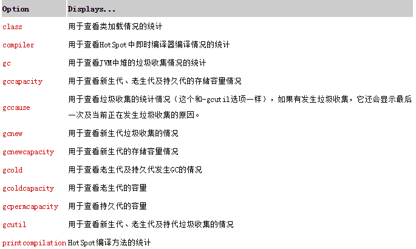

#### jstat

- 类的加载及卸载情况
- 查看新生代、老生代及持久代的容量及使用情况
- 查看新生代、老生代及持久代的垃圾收集情况，包括垃圾回收的次数及垃圾回收所占用的时间
- 查看新生代中Eden区及Survior区中容量及分配情况等

###### 语法  
jstat [ generalOption | outputOptions vmid [interval[s|ms] [count]] ]  

- generalOption - 单个的常用的命令行选项，如-help, -options, 或 -version。  

- outputOptions -一个或多个输出选项，由单个的statOption选项组成，可以和-t, -h, and -J等选项配合使用。  

- statOption：根据jstat统计的维度不同，可以使用如下表中的选项进行不同维度的统计，不同的操作系统支持的选项可能会不一样，可以通过-options选项，查看不同操作系统所支持选项，   




###### 示例
```
jstat -gc 16937  

 S0C    S1C    S0U    S1U      EC       EU        OC         OU       MC     MU    CCSC   CCSU   YGC     YGCT    FGC    FGCT     GCT  

32256.0 32768.0  0.0   9149.9 280064.0 270423.7  215552.0   145989.1  128552.0 124611.6 14896.0 14169.2  16609  436.445  700   266.861  703.306    

jstat -gccapacity 16937
 NGCMN    NGCMX     NGC     S0C   S1C       EC      OGCMN      OGCMX       OGC         OC       MCMN     MCMX      MC     CCSMN    CCSMX     CCSC    YGC    FGC  

 21504.0 349184.0 349184.0 32256.0 31744.0 285184.0    44032.0   699392.0   215552.0   215552.0      0.0 1163264.0 128552.0      0.0 1048576.0  14896.0  16624   700
```

>
引用  

[oracle官网](https://docs.oracle.com/javase/1.5.0/docs/tooldocs/share/jstat.html)  

[一个blog](https://bijian1013.iteye.com/blog/2221351)   


#### jstack
 jstack用于打印出给定的java进程ID或core file或远程调试服务的Java堆栈信息。

###### 语法  

$jstack [ option ] pid
$jstack [ option ] executable core
$jstack [ option ] [server-id@]remote-hostname-or-IP

参数说明:

- pid: java应用程序的进程号,一般可以通过jps来获得;
- executable:产生core dump的java可执行程序;
- core:打印出的core文件;
- remote-hostname-or-ip:远程debug服务器的名称或IP;
- server-id: 唯一id,假如一台主机上多个远程debug服务;

###### 示例  

```
jstack 16937 >1.txt

DubboClientHandler-10.57.17.40:20880-thread-377" #1200249 daemon prio=5 os_prio=0 tid=0x00007fe12c05c000 nid=0x9dc waiting on condition [0x00007fe0b3381000]
   java.lang.Thread.State: TIMED_WAITING (parking)
        at sun.misc.Unsafe.park(Native Method)
        - parking to wait for  <0x00000000c891a890> (a java.util.concurrent.SynchronousQueue$TransferStack)
        at java.util.concurrent.locks.LockSupport.parkNanos(LockSupport.java:215)
        at java.util.concurrent.SynchronousQueue$TransferStack.awaitFulfill(SynchronousQueue.java:460)
        at java.util.concurrent.SynchronousQueue$TransferStack.transfer(SynchronousQueue.java:362)
        at java.util.concurrent.SynchronousQueue.poll(SynchronousQueue.java:941)
        at java.util.concurrent.ThreadPoolExecutor.getTask(ThreadPoolExecutor.java:1066)
        at java.util.concurrent.ThreadPoolExecutor.runWorker(ThreadPoolExecutor.java:1127)
        at java.util.concurrent.ThreadPoolExecutor$Worker.run(ThreadPoolExecutor.java:617)
        at java.lang.Thread.run(Thread.java:745)


tid, Java memory address of its internal Thread control structure.

nid, native thread id. 每一个nid对应于linux下的一个tid, 即lwp  (light weight process, or thread)

我们平时一般看nid，代表着16进制的线程号。

线程状态有：
死锁，Deadlock（重点关注）
执行中，Runnable  
等待资源，Waiting on condition（重点关注）
等待获取监视器，Waiting on monitor entry（重点关注）
暂停，Suspended
对象等待中，Object.wait() 或 TIMED_WAITING
阻塞，Blocked（重点关注） 
停止，Parked
```


>
引用
[oracle官网]（https://docs.oracle.com/javase/1.5.0/docs/tooldocs/share/jstack.html）

#### jmap

jmap [ option ] pid 
jmap [ option ] executable core 
jmap [ option ] [server-id@]remote-hostname-or-IP 

-dump:[live,]format=b,file=<filename> 使用hprof二进制形式,输出jvm的heap内容到文件=. live子选项是可选的，假如指定live选项,那么只输出活的对象到文件. 
-finalizerinfo 打印正等候回收的对象的信息. 
-heap 打印heap的概要信息，GC使用的算法，heap的配置及wise heap的使用情况. 
-histo[:live] 打印每个class的实例数目,内存占用,类全名信息. VM的内部类名字开头会加上前缀”*”. 如果live子参数加上后,只统计活的对象数量，加上live是触发一次fullGC。
-permstat 打印classload和jvm heap长久层的信息. 包含每个classloader的名字,活泼性,地址,父classloader和加载的class数量. 另外,内部String的数量和占用内存数也会打印出来. 
-F 强迫.在pid没有相应的时候使用-dump或者-histo参数. 在这个模式下,live子参数无效. 
-h | -help 打印辅助信息 
-J 传递参数给jmap启动的jvm. 


#### pmap

