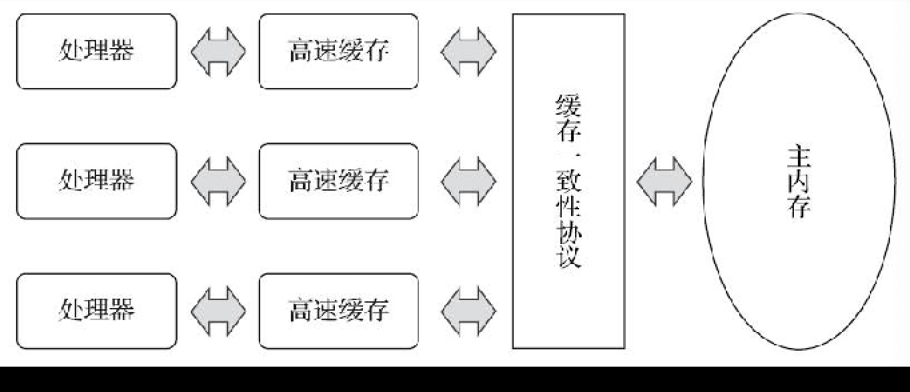
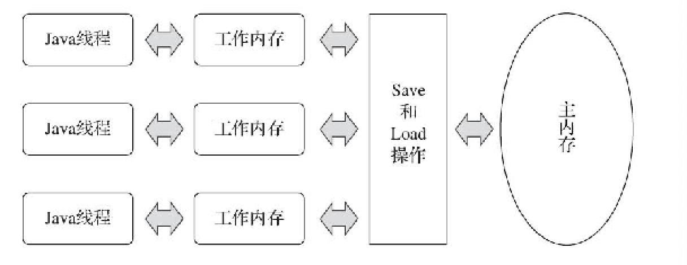

### 硬件的效率一致性
现在计算机存储设备与处理器的运算速度有着几个数量级的差距。所以现在计算机不得不加入一层或者多层高速缓存（Cache）来作为内存和处理器之间的缓冲；基于高速缓存的存储交互很好地解决了处理器与内存速度之间的矛盾，但是也为计算机系统带来了更高的复杂度，它引入了一个新问题：缓存一致性（Cache Coherence）。为了解决缓存一致性问题，需要各个处理器访问缓存时都遵循一些协议，在读写时要根据协议来进行操作，这类协议有MSI、MESI、MOSI、Synapse、Firefly及DragonProtocol等。



除了增加高速缓存之外，处理器可能会对输入代码进行乱序执行优化，保证该结果与顺序执行的结果一致的，但并不保证程序中各语句计算的先后顺序与输入代码中的顺序一致，Java虚拟机的即时编译也有指令重排序。

### Java内存模型
《Java虚拟机规范》中曾经试图定义一种“Java内存模型”（Java Memory Model, JMM）来屏蔽各种硬件和操作系统的内存访问差异，以实现让Java程序在各种平台下都能达到一致的内存访问的效果。（之前C/C++直接使用操作系统和物理硬件的内存模型，在某些场景并发场景下，可能会针对不同平台编写程序）。经过长时间的验证和修补，直到JDK5（实现了JSR-133）发布后，Java内存模型才终于成熟、完善起来。

#### a. 主内存与工作内存
Java内存模型规定了所有变量都存储在主内存中，每个线程还有自己的工作内存，线程的工作内存保存了被该线程使用的变量的主内存副本，线程对变量的操作都必须在工作内存中进行，而不能直接读写主内存中数据。不同线程之间也无法直接访问对方工作内存中变量。
> 此处讲的工作内存，与内存区域中堆、栈，处理器高速缓存、内存，没有直接关系。不过可以理解为线程对于堆、方法区等线程共享部分数据使用，在高速缓存中一份副本，操作都基于这个副本。



#### b. 主内存与工作内存之间交互
主内存与工作内存之间的交互协议，Java内存模型定义了8种操作来完成。其中Java虚拟机实现时保证了每次操作都是原子的、不可再分的。
* lock：作用与主内存的变量，它把一个变量标识为一条线程独占的状态。
* unlock：作用于主内存变量，把一个处于锁定状态的变量释放出来，释放后的变量才可以被其它线程锁定。
* read（读取）：作用于主内存变量，把一个变量值从主内存传输到工作内存，以便后续load操作使用。
* load（载入）：作用于工作内存，把read读到的值，放入到工作内存的变量副本中。
* use（使用）：作用工作内存变量，把工作内存变量传递给执行引擎。
* assign（赋值）：作用于工作内存，它把一个从执行引擎接收到的值赋值给工作内存。
* store（存储）：作用于工作内变量，把工作内存中一个变量值传送到主内存中。
* write（写入）：作用于主内存中，把store操作从工作内存中获取值赋值到主内存的变量中。

>Java内存模型要求store、write，read、load是顺序的，但不是连续的，中间可以插入其他指令。且是两者一起出现的。  

>不允许一个线程丢弃它最近的assign操作，即变量在工作内存改变后必须把该变化同步到主内存。不允许一个线程没有assign操作，把数据同步回主内存。  

>一个新变量只能在主内存中诞生，不允许工作内存使用一个未被初始化变量。

>一个变量同一时刻只允许被同一个线程lock，但是lock可以被执行多次，执行多次后，只有被执行多次的unlock，变量才会被解锁。如果一个变量执行lock操作，那将会清空工作内存中此变量值，执行引擎使用前需要重新load或者assign。对一个变量执行unlock操作前，必须先把此变量同步回主内存。

上述8中操作，再加上volatile的一些特殊规定就已经准确的描述了，Java内存操作，哪些在并发下是安全的。不过这些操作过于繁琐，后来java设计团队，简化成read，write，lock，unlock四种操作。

#### c. volatile的特殊规则
Java内存模型为volatile专门定义了一些特殊访问规则。当一个变量被定义为volatile之后，它将具备两项特征： 

---
1. 可见性：当一条线程修改了这个变量的值，新值对其它线程来说是可以立即得知。   
   
volatile并不是原子性的，在并发环境下，Java运算操作符并非原子操作，这导致volatile变量在并发环境下一样不安全。例如i++，反编译后指令
```
//从工作内存取到数据放到栈顶，volatile只能保证这个一步可以去到正确的数据，
//如果后续在iconst_1，iadd过程中，其它线程可能已经修改了i的值，写回工作内存的数据也会变小。
getstatic  ..
iconst_1
iadd
pustatic ..
```
在不符合以下两条规则的运算场景中，我们仍然要通过加锁来保证原子性：
* 运算结果并不依赖变量当前值，或者能够确保只有单一线程修改变量的值。
* 变量不需要与其它状态变量共同参与不变约束（也是是用变量做判断条件时，只采用该变量）。

---
2. 禁止指令重排序
从硬件架构上讲，指令重排序是指采用了允许将多条指令不按程序规定的顺序分开发送给各个相应的电路单元进行处理。但并不是说指令任意重排，处理器必须能正确处理指令依赖情况保障程序得出正确的执行结果。
具体实现采用内存屏障，“指令重排序无法越过内存屏障”，原语中采用`lock addl$0x0`实现。

---
-volatile的意义-
大多数场景下，volatile的总开销仍然要比锁来得更低，我们在volatile与锁中选择的唯一判断依据仅仅是volatile的语义能否满足使用场景需求。

#### d. 针对long和double型变量的特殊规则
Java内存模型允许虚拟机将没有被volatile修饰的64位数据的读写操作划分为两次32位的操作来进行。这就是所谓的“long和double的非原子性协定”。JDK9中新增了一个实验性参数-XX:+AlwaysAtomicAccesses来约束虚拟机对所有数据类型进行原子性访问。

#### e. 原子性、可见性、有序性
---
1. 原子性
Java内存模型来直接保证原子性的变量操作read、load、assign、use、store和write这六个，大致可以认为基本数据类型的访问、读写都是具备原子性的（例外是long和double的非原子性协定）。
如果应用场景需要一个更大范围的原子性保证，Java内存模型提供了lock和unlock来满足。虚拟机未把lock和unlock开放给用户使用，提供了更高层次的monitorenter和monitorexit来隐式地使用这两个操作，反映到Java代码中，对应synchronized关键字。

---
2. 可见行
普通变量与volatile变量的区别是，volatile的特殊规则保证了新值能立即同步到主内存，以及每次使用前立即从主内存刷新。
除了volatile之外，Java还有两个关键字能实现可见性，它们是synchronized和final。synchronized同步块的可见性，是由“对一个变量执行unlock操作之前，必须先把此变量同步回主内存中”。final的可见行：被final修饰的字段在构造器中一旦初始化完成，并且构造器没有把“this”引用传递出去（没有引用逃逸），那么其它线程就可以看到这个变量。  

    [具体可以看这篇文章](https://blog.csdn.net/qq_42634696/article/details/104880010)
--
3. 有序性
Java中的有序性可以总结为：如果在本线程内观察，所有的操作都是有序的；如果一个线程暗中观察另一个线程，所有操作都是无序的。后半句是指“指令重排序”现象和“工作内存与主存同步延迟现象”。
Java提供了volatile和synchronized两个关键字来保证线程之间操作的有序性。volatile禁止了指令重排，synchronized保证了线程串行进入同步块。

#### f. 先行发生原则（Happens-Before）

先行发生是Java内存模型中定义的两项操作之间的偏序关系。它是判断数据是否存在竞争，线程是否安全的非常有用的手段。如果两个操作之间没有符合happen-before，那么虚拟机可以对他们随意进行重排序。

* 程序次序规则：在一个线程内，按照控制流顺序，书写在前面的操作先行发生于书写后面的操作。
* 管程锁定规则：一个unlock操作先行发生于后面对同一个锁的lock操作。
* volatile变量规则：对一个volatile变量的写操作先行发生于后面对这个变量的读操作。后面指时间上的先后。
* 线程启动规则：Thread对象的start方法先行发生于该线程的每一个动作。
* 线程终止规则：线程中的所有操作，都先行发生于对此线程的终止检测，我们可以通过Thread::join方法是否结束、Thread::isAlive()的返回值等手段检测线程是否终止运行。
* 线程中断规则：对线程interrupt()的方法调用，先行发生于被中断线程的中断检测interrupted()。
* 对象终结规则：一个对象的初始化完成，先行发生于finalize()调用。
* 传递性：如果操作A先行发生于B，B先行发生于C，那么A先行发生于C.s


