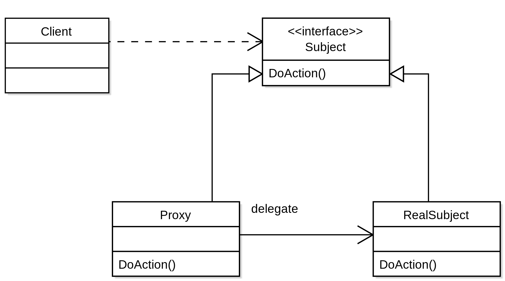

### 一、反射
##### 1.1 概念
维基百科上的定义：
>在计算机学中，反射（英语：reflection）是指计算机程序在运行时（runtime）可以访问、检测和修改它本身状态或行为的一种能力。用比喻来说，反射就是程序在运行的时候能够“观察”并且修改自己的行为。    

>要注意术语“反射”和“内省”（type introspection）的关系。内省（或称“自省”）机制仅指程序在运行时对自身信息（称为元数据）的检测；反射机制不仅包括要能在运行时对程序自身信息进行检测，还要求程序能进一步根据这些信息改变程序状态或结构。  

>在类型检测严格的面向对象的编程语言如Java中，一般需要在编译期间对程序中需要调用的对象的具体类型、接口、字段和方法的合法性进行检查。反射技术则允许将对需要调用的对象的信息检查工作从编译期间推迟到运行期间再现场执行。这样一来，可以在编译期间先不明确目标对象的接口名称、字段（fields，即对象的成员变量）、可用方法，然后在运行根据目标对象自身的信息决定如何处理。它还允许根据判断结果进行实例化新对象和相关方法的调用。

oracle对于反射的定义  
> Reflection enables Java code to discover information about the fields, methods and constructors of loaded classes, and to use reflected fields, methods, and constructors to operate on their underlying counterparts, within security restrictions.
The API accommodates applications that need access to either the public members of a target object (based on its runtime class) or the members declared by a given class. It also allows programs to suppress default reflective access control.
  
> 简而言之，通过反射，我们可以在运行时获得程序或程序集中每一个类型的成员和成员的信息。程序中一般的对象的类型都是在编译期就确定下来的，而 Java 反射机制可以动态地创建对象并调用其属性，这样的对象的类型在编译期是未知的。所以我们可以通过反射机制直接创建对象，即使这个对象的类型在编译期是未知的。

反射的核心是 JVM 在运行时才动态加载类或调用方法/访问属性，它不需要事先（写代码的时候或编译期）知道运行对象是谁。  

##### 1.2 反射可以解决什么问题

* 开发通用框架 - 反射最重要的用途就是开发各种通用框架。很多框架（比如 Spring）都是配置化的（比如通过 XML 文件配置 JavaBean、Filter 等），为了保证框架的通用性，它们可能需要根据配置文件加载不同的对象或类，调用不同的方法，这个时候就必须用到反射——运行时动态加载需要加载的对象。
* 动态代理 - 在切面编程（AOP）中，需要拦截特定的方法，通常，会选择动态代理方式。这时，就需要反射技术来实现了。
* 注解 - 注解本身仅仅是起到标记作用，它需要利用反射机制，根据注解标记去调用注解解释器，执行行为。如果没有反射机制，注解并不比注释更有用。
* 可扩展性功能 - 应用程序可以通过使用完全限定名称创建可扩展性对象实例来使用外部的用户定义类。

##### 1.3 java中反射的实现

Java 反射主要提供以下功能：
* 在运行时判断任意一个对象所属的类；
* 在运行时构造任意一个类的对象；
* 在运行时判断任意一个类所具有的成员变量和方法（通过反射甚至可以调用private方法）；
* 在运行时调用任意一个对象的方法；
  
 示例 
```
     Class cls = Class.forName("testforuse.jdk.reflect.ReflectUser");
     Object object = cls.newInstance();

     Method method = cls.getMethod("invoke");
     method.invoke(object);
```


### 二、动态代理
提到动态代理的话，我们可以从两个角度来理解：动态、代理模式
>代理模式： 为其它对象提供一种代理以控制对这个对象的访问控制；在某些情况下，客户不想或者不能直接引用另一个对象，这时候代理对象可以在客户端和目标对象之间起到中介的作用。

##### 2.1 静态代理


要理解，我们通常说的动态，静态，指的是一个在运行时生成，一个在编译时生成。那么静态代理就是在编译时写好代理对象，对于每一个需要代理的类，我们都手动的去撰写，一个代理类。

##### 2.2 动态代理jdk中实现
先看示例：

##### 2.3 动态代理cglib中实现
