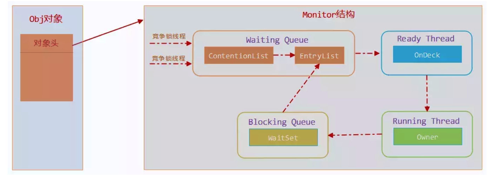

### 线程安全
当多个线程同时访问一个对象时，如果不用考虑这些线程在运行时环境下的调度和交替执行，也不需要进行额外的同步，或者在调用方进行任何其他协调操作，调用这个对象的行为都可以获取正确的结果，那么就称这个对象是线程安全的。

#### Java语言中的线程安全
按照线程安全的“安全程度”由强至弱来排序，可以将Java语言中各种操作共享的数据分为以下五类：不可变、绝对线程安全、相对线程安全和线程对立。
1. 不可变  
在Java语言里面（JDK5以后），不可变（Immutable）对象一定是线程安全的，无论是对象的方法实现还是方法调用都不需要再进行任何线程安全保障。  
Java语言中，如果多线程共享的是一个基本数据类型，那么只要定义时使用final关键字修饰它就可以保证它是不可变的。如果是一个对象，目前Java语言目前暂时还没有提供值类型的支持，需要对象自行保证其行为不会对状态产生任何影响。例如String.substring()，会return new String，不影响原来的值。

2. 绝对线程安全  
绝对线程安全能够完全满足关于线程安全的定义，不过付出代价高昂。在Java API标注自己是线程安全的类，大多数不是绝对线程安全。

1. 相对线程安全  
   相对线程安全就是我们通常意义上所讲的线程安全，它保证对这个对象单次！操作是线程安全的，我们在调用的时候不需要进行额外的保障措施，但是对于一些特定的顺序调用，就可能需要在调用端使用额外的同步手段来保证调用正确性。

2. 线程兼容  
   线程兼容是指对象本身不是线程安全的，可以通过在调用端正确使用同步手段来保证对象在并发环境中可以安全使用。通常说的的非线程安全类就是这种情况。

3. 线程对立  
   不管调用端，是否采用同步措施，都无法在多线程环境中并发使用代码。例如Thread的suspend()和resume()。

#### 线程安全的实现方法  
---
  **互斥同步** 

互斥同步是一种最常见的也是最主要的并发正确性保障手段。同步是指在多个线程并发访问共享数据时，保证共享数据在同一时刻只被一个线程使用。常见互斥实现方式有：临界区、互斥量、信号量。
* 在Java里面，最基本的互斥同步手段就是synchronized关键字。经过javac反编译后，同步块前后分别形成monitorenter和monitorexit这两个字节码指令。这两个字节码都需要一个reference类型的参数来指定需要锁定和解锁的对象。  
  
  > synchronized修饰，线程是可重入的（monitorenter指令执行，如果当前线程未被锁定或者当前线程持有该对象，锁计数器加一，monitorexit则减一），无条件阻塞后续线程进入，不能强制释放锁、无法强制正在等待锁的线程中断或超时推出，是一个重量级操作。虚拟机针在jdk6之后对，sychronized做了一些优化，后续会锁优化会提到，优化后跟ReentrantLock性能基本持平。
* 在JDK5开始，Java类库提供了java.util.concurrent包，其中java.util.concurrent.locks.Lock接口便成了Java中另一种实现同步的手段。重入锁（ReentrantLock）是Lock接口常见的一种实现。  

  > 相比synchronized，Reentrantlock增加了一些高级功能：等待可中断、公平锁、绑定多个条件。

  > 等待可中断指持有锁线程长期不释放锁时，正在等待的线程可以放弃等待；公平锁是指多个线程等待同一个锁时，是否按照申请锁的时间来获取锁。默认非公平，可以通过构造函数参数指定，公平锁会导致性能严重下降；绑定多个条件指可以绑定多个condition对象。

互斥同步是一种悲观并发策略，其任务如果不去做正确的同步措施，那肯定出问题，就是没有线程竞争也会加锁。会有用户态内核态切换、维护锁计数器和检查是否有被阻塞的线程需要被唤醒等开销。

---
   **非阻塞同步**  

   随着指令集的发展，现在有了另一种的选择：基友冲突检测的乐观并发策略。通俗上将先进行操作，如果产生冲突，在进行补偿。最常用的补偿措施是不断的重试。  

   这种乐观并发策略实现不再需要把线程阻塞挂起，因此这种同步操作被成为非阻塞同步（Non-Blocking Synchronization），这种代码措施也常被称作无锁（Lock-Free）编程。
   
   为什么说使用乐观并发策略需要“硬件指令集的发展”？因为操作和冲突检测这两个步骤具备原子性，原子性需要硬件来支持。这类指令常用的有：测试并设置（Test-and-Set），获取并增加（Fetch-and-Incremennt），交换（Swap），比较并交换（Compare-and-Swap，简称CAS），加载链接/条件储存（Load-Linked/Store-Conditional），Java语言中最终暴露出来的是CAS操作，在IA64、X86指令集中采用cmpxchg指令完成CAS功能。

   JDK5之后，Java类库才开始使用CAS操作，该操作由sun.misc.Unsafe类里面的compareAndSwapInt()和compareAndSwapLong()等几个方法包装提供。不过Unsafe类在设计时，不是提供给用户程序使用的类，BootstrapClassLoader加载的类才能使用。直到JDK9之后，Java类库在VarHandle类里开放了面向用户程序使用的CAS操作。

   > ABA问题：CAS的语义上存在一个逻辑漏洞，如果一个变量V初次读取是A，期间曾经被改为B，后来又被改回A，那么CAS操作认为它未改变过。大部分情况下ABA问题不会影响到程序的正确性，如果需要解决可以采用互斥同步解决。JUC也曾经引入一个AtomicStampedReference来解决，通过控制变量值版本来解决，不过这个类比较鸡肋。
---
   **无同步方案**

   无同步就是避免共享数据，线程之间没有数据共享，那么就不需要任何同步措施保证其正确性。
   可重入代码（Reentrant Code）：这种代码又称纯代码（Pure Code），是指代码执行的任何时刻中断它，转而去执行其它代码，而控制权返回后，原来的程序不会出现任何错误。
   可重入代码一些共同特征：不依赖全局变量、存储在堆上的公共数据和公共系统资源，用到的状态量都由参数种传入，不调用非可重入方法。

   > 应用示例：TheadLocal，单线程消费的消费队列，web请求与服务线程一一对应关系等。

 ### 锁优化
高效并发是从JDK5到JDK6后的一项重要改进项，HotSpot虚拟机团队在这个版本上花费了大量资源去实现各种锁优化技术，如适应性自旋（adaptive spinning）、锁消除（lock elimination）、锁膨胀（lock coarsening）、轻量级锁（lightweight locking）、偏向锁（biased  locking）等。

 #### 自旋锁与自适应自旋

互斥同步对性能最大最大的影响是阻塞实现，挂起和恢复线程操作，都需要转入内核态完成。虚拟机团队注意到很多应用，很多共享数据只会持续很短一段时间，为了这段时间去挂起和恢复线程并不值得。可以让等待线程空等一会，执行一个忙循环（自旋），就是所谓自旋锁。

自旋锁在1.4.2中就引入了，默认关闭，需要通过-XX:+UseSpinning参数来开启。在JDK6之后默认开启。

如果锁占用时间很短，自旋效果就会很好，反之如果锁被占用时间很长，那么线程就白白消耗处理器资源，带来性能损耗。因此自旋等待时间必须有个时间限定，超过限定次数让人没有成功获得锁，就传统方式挂起。

默认次数是10，可以通过-XX:PreBlockSpin来自行更改。JDK6引入自适应自旋，自旋时间，由同一个锁的上一次自旋时间来决定。如果同一个锁对象上，自旋等待刚刚成功过，那么运行自选等待持续相对更长时间；另一方面，如果某锁很少自选成功，那么这个锁可能直接忽略自旋。

#### 锁消除
锁消除是指虚拟机即时编译运行时，对一些代码要求同步，但是被检测到不可能存在共享数据竞争的锁进行消除。锁消除的主要判定依据来源于逃逸分析的数据支持。
或许会怀疑，变量是否逃逸，对虚拟机来说需要复杂的过程才能确定，但是程序员应该很清楚代码中数据是否存在竞争。这个问题，很多同步措施并不是应用程序自己加入的。同步代码在Java程序中的出现频繁程度也许超过大部分读者的想象，如下示例。
```
public String concatString(String s1,String s2,String s3){
   return s1+s2+s3;
}
由于String是final修饰的，对字符串操作会生成新的字符串，JDK5之前会会转化为StringBuffer操作的append()操作，JDK5及以后版本中会转化为StringBuilder对象的连续append()操作。jdk5之前javac之后如下：
public String concatString(String s1,String s2,String s3){
   StringBuffer sb = new StringBuffer();
   sb.append(s1);
   sb.append(s2);
   sb.append(s3);
   return sb.toString();
}

```

#### 锁粗化
在编写代码时，推荐将同步块的作用范围限制的尽量小，这是为了保证锁线程尽快拿到锁。大多数情况下这原则是正确的，但是如果一系列的连续操作都是对同一个对象反复加锁和解锁，甚至加锁操作在循环体里面，那么就会带来性能损耗。、
例如concatString的示例，三个append()只需要加锁一次就可以了。  

#### 锁升级
传统的锁（也就是下文要说的重量级锁）依赖于系统的同步函数，在linux上使用mutex互斥锁，这些同步函数都涉及到用户态和内核态的切换、进程的上下文切换，成本较高。  
在JDK 1.6引入了两种新型锁机制：偏向锁和轻量级锁，它们的引入是为了解决在没有多线程竞争的场景下因使用传统锁机制带来的性能开销问题。  
在JDK1.6中，锁一共有4种状态，级别从高到底依次是：无锁状态、偏向锁状态、轻量级锁状态、重量级锁状态。这几个状态会随着锁竞争加剧而逐渐升级。    

>“绝大多数锁，在整个同步周期内都是不存在竞争的”   

>“如果确实存在竞争，除了互斥量本身的开销，还额外发生了CAS开销。因此在有竞争的情况下，轻量级锁反而会比传统重量级锁更慢”

后面一节专门论述该过程

### 锁升级详解

#### 知识前述
**markword**

```
64 bits:
  --------
  unused:25 hash:31 -->| unused:1   age:4    biased_lock:1 lock:2 (normal object)
  JavaThread*:54 epoch:2 unused:1   age:4    biased_lock:1 lock:2 (biased object)
  PromotedObject*:61 --------------------->| promo_bits:3 ----->| (CMS promoted object)
  size:64 ----------------------------------------------------->| (CMS free block)

  unused:25 hash:31 -->| cms_free:1 age:4    biased_lock:1 lock:2 (COOPs && normal object)
  JavaThread*:54 epoch:2 cms_free:1 age:4    biased_lock:1 lock:2 (COOPs && biased object)
  narrowOop:32 unused:24 cms_free:1 unused:4 promo_bits:3 ----->| (COOPs && CMS promoted object)
  unused:21 size:35 -->| cms_free:1 unused:7 ------------------>| (COOPs && CMS free block)
 [ptr             | 00]  locked             ptr points to real header on stack
 [header      | 0 | 01]  unlocked           regular object header
 [ptr             | 10]  monitor            inflated lock (header is wapped out)
 [ptr             | 11]  marked             used by markSweep to mark an object

32 bits:
  --------
  hash:25 ------------>| age:4    biased_lock:1 lock:2 (normal object)
  JavaThread*:23 epoch:2 age:4    biased_lock:1 lock:2 (biased object)
  size:32 ------------------------------------------>| (CMS free block)
  PromotedObject*:29 ---------->| promo_bits:3 ----->| (CMS promoted object)
 ```       
 以32位为例，25位为hash，4位的年龄标记，一位偏向锁标记，2位锁标记（00[轻量级锁]，01[无锁]，10[重量级锁]，11[cms标记]）。  

 锁状态，23位指向占用线程指针，2位epoch[偏向锁的时间戳]，4位的年龄标记，一位偏向锁标记，2位锁标记（00[轻量级锁]，01[无锁]，10[重量级锁]，11[cms标记]）。

**Lock Record**  
在线程进入同步代码块的时候，如果此同步对象没有被锁定，即它的锁标志位是01，则虚拟机首先在当前线程的栈中创建我们称之为“锁记录（Lock Record）”的空间，用于存储锁对象的Mark Word的拷贝，官方把这个拷贝称为Displaced Mark Word。整个Mark Word及其拷贝至关重要。

*Lock Record是线程私有的数据结构*，每一个线程都有一个可用Lock Record列表，同时还有一个全局的可用列表。每一个被锁住的对象Mark Word都会和一个Lock Record关联（对象头的MarkWord中的Lock Word指向Lock Record的起始地址），同时Lock Record中有一个Owner字段存放拥有该锁的线程的唯一标识（或者object mark word），表示该锁被这个线程占用。


#### 重量级锁
我们在前面讲到Java的锁同步时，有提到过jvm是通过monitorenter和monitorexit指令来实现的，在底层C++代码中是Monitor来实现的，具体的类是ObjectMonitor。其中Java中每个Object都会指向一个ObjectMonitor，这也可以理解synchronized是对象锁，作用粒度是对象这一个含义。其中ObjectMonitor对象是存在markword中。

```  
ObjectMonitor() {
    _header       = NULL;
    _count        = 0; // 记录个数
    _waiters      = 0,
    _recursions   = 0;
    _object       = NULL;
    _owner        = NULL;
    _WaitSet      = NULL; // 处于wait状态的线程，会被加入到_WaitSet
    _WaitSetLock  = 0 ;
    _Responsible  = NULL ;
    _succ         = NULL ;
    _cxq          = NULL ;
    FreeNext      = NULL ;
    _EntryList    = NULL ; // 处于等待锁block状态的线程，会被加入到该列表
    _SpinFreq     = 0 ;
    _SpinClock    = 0 ;
    OwnerIsThread = 0 ;
  }
```  
ObjectMonitor中有两个队列，_WaitSet 和 _EntryList，用来保存ObjectWaiter对象列表（ 每个等待锁的线程都会被封装成ObjectWaiter对象 ），_owner指向持有ObjectMonitor对象的线程，当多个线程同时访问一段同步代码时：
  
1. 首先会进入 _EntryList 集合，当线程获取到对象的monitor后，进入 _Owner区域并把monitor中的owner变量设置为当前线程，同时monitor中的计数器count加1；
2. 若线程调用 wait() 方法，将释放当前持有的monitor，owner变量恢复为null，count自减1，同时该线程进入 WaitSet集合中等待被唤醒；
3. 若当前线程执行完毕，也将释放monitor（锁）并复位count的值，以便其他线程进入获取monitor(锁)；
  
> 我们提到互斥是重量级操作，从整个过程也是可以理解的，线程进入entrylist后，是依赖线程调度来保证执行线程的，其中线程调度是内核态实现，会涉及到上下文切换，即便是只有一个线程。*这也是自旋锁的意义*。

> 这个过程，我们也可以跟公平锁/非公平锁，object的wait/notify/notifyall想关联。

#### 轻量级锁
获取轻量级锁过程：
1. 在线程进入同步块时，如果同步对象锁状态为无锁状态（锁标志位为“01”状态，是否为偏向锁为“0”），虚拟机首先将在当前线程的栈帧中建立一个名为锁记录（Lock Record）的空间。
2. 拷贝对象头中的Mark Word复制到锁记录（Lock Record）中。
3. 拷贝成功后，虚拟机将使用CAS操作尝试将对象Mark Word中的Lock Word更新为指向当前线程Lock Record的指针，并将Lock record里的owner指针指向object mark word。如果更新成功，则执行步骤4，否则执行步骤5。
4. 如果这个更新动作成功了，那么当前线程就拥有了该对象的锁，并且对象Mark Word的锁标志位设置为“00”，即表示此对象处于轻量级锁定状态。
5. 如果这个更新操作失败了，虚拟机首先会检查对象Mark Word中的Lock Word是否指向当前线程的栈帧，如果是，就说明当前线程已经拥有了这个对象的锁，那就可以直接进入同步块继续执行。否则说明多个线程竞争锁，进入自旋执行（3），若自旋结束时仍未获得锁，轻量级锁就要膨胀为重量级锁，锁标志的状态值变为“10”，Mark Word中存储的就是指向重量级锁（互斥量）的指针，当前线程以及后面等待锁的线程也要进入阻塞状态。

锁释放过程：
1. 通过CAS操作尝试把线程中复制的Displaced Mark Word对象替换当前的Mark Word；
2. 如果替换成功，整个同步过程就完成了，恢复到无锁状态（01）；如果此时释放后，有其它线程自旋中，也可以获得锁。也不会进入步骤3。
3. 如果替换失败，说明有其他线程尝试过获取该锁（此时锁已膨胀），那就要在释放锁的同时，唤醒被挂起的线程；

> 从获取锁的过程中可以发现，当线程重入一个对象锁时，每次都需要cas，即便是没有竞争的情况下。然而CAS操作会涉及到本地延迟问题（cpu本地内存刷新），会有性能损耗。这就引出了，为什么会有偏向锁。


#### 偏向锁
 引入偏向锁主要目的是：为了在没有多线程竞争的情况下尽量减少不必要的轻量级锁执行路径。因为轻量级锁的加锁解锁操作是需要依赖多次CAS原子指令的，而偏向锁只需要在置换ThreadID的时候依赖一次CAS原子指令（由于一旦出现多线程竞争的情况就必须撤销偏向锁，所以偏向锁的撤销操作的性能损耗也必须小于节省下来的CAS原子指令的性能消耗）。

 获取偏向锁过程：
1. 检测Mark Word是否为可偏向状态，即是否为偏向锁1，锁标识位为01；
2. 若为可偏向状态，则测试线程ID是否为当前线程ID，如果是，则执行步骤5，否则执行步骤3；
3. 如果测试线程ID不为当前线程ID，则通过CAS操作竞争锁，竞争成功，则将Mark Word的线程ID替换为当前线程ID，否则执行线程4；
4. 通过CAS竞争锁失败，证明当前存在多线程竞争情况，当到达全局安全点，获得偏向锁的线程被挂起，偏向锁升级为轻量级锁，然后被阻塞在安全点的线程继续往下执行同步代码块；
5. 执行同步代码块；

释放偏向锁过程：
1. 暂停拥有偏向锁的线程；
2. 判断锁对象是否还处于被锁定状态，否，则恢复到无锁状态（01），以允许其余线程竞争。是，则挂起持有锁的当前线程，并将指向当前线程的锁记录地址的指针放入对象头Mark Word，升级为轻量级锁状态（00），然后恢复持有锁的当前线程，进入轻量级锁的竞争模式；


 ### 参考
  整体知识体系参考：《深入理解Java虚拟机》    

  锁升级部分参考：  
[并发基石-Markword与锁升级](https://cloud.tencent.com/developer/article/1648312)     
[死磕Synchronized底层实现](https://github.com/farmerjohngit/myblog/issues/12)  
[深入分析synchronized原理](https://www.cnblogs.com/aspirant/p/11470858.html)


