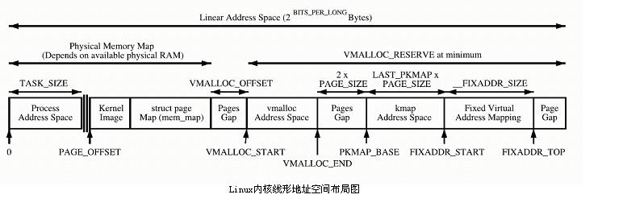
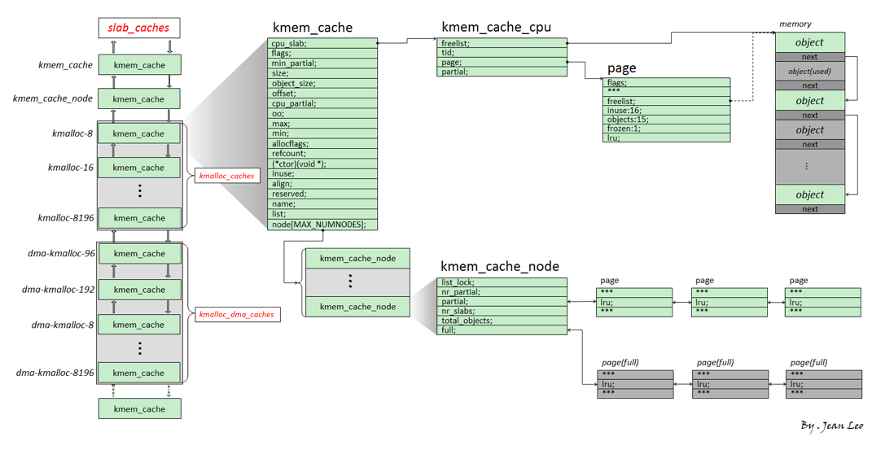

### 一、物理内存组织方式
#### 1.1 平坦内存模型
物理地址是连续的，页也是连续的，每个页大小也是一样的。整个物理内存的布局就非常简单、易管理，这就是最经典的平坦内存模型。  

#### 1.2 SMP
CPU 也会有多个，在总线的一侧。所有的内存条组成一大片内存，在总线的另一侧，所有的 CPU 访问内存都要过总线，而且距离都是一样的，这种模式称为 SMP（Symmetric multiprocessing），即对称多处理器。当然，它也有一个显著的缺点，就是总线会成为瓶颈，因为数据都要走它。

#### 1.3 NUMA
为了提高性能和可扩展性，后来有了一种更高级的模式，NUMA（Non-uniform memory access），非一致内存访问。在这种模式下，内存不是一整块。每个 CPU 都有自己的本地内存，CPU 访问本地内存不用过总线，因而速度要快很多，每个 CPU 和内存在一起，称为一个 NUMA 节点。但是，在本地内存不足的情况下，每个 CPU 都可以去另外的 NUMA 节点申请内存，这个时候访问延时就会比较长。

内存被分成了多个节点，每个节点再被分成一个一个的页面。由于页需要全局唯一定位，页还是需要有全局唯一的页号的。但是由于物理内存不是连起来的了，页号也就不再连续了。

具体SMP和NUMA参考下图：


### 二、物理内存管理
操作系统中地址是，线性地址-逻辑地址-物理地址，线性地址一般是分段机制，逻辑地址是页机制。在Linux操作系统中，没有使用分段地址，虚拟地址就是逻辑地址。  

在32位操作系统中，3G是用户空间，1G是内核空间，其中内核空间管理如下。

#### 2.1 pglist_data
每一个内存块用一个pglist_data的结构来维护，其概要属性如下：
```
每一个节点都有自己的 ID：node_id；
node_mem_map 就是这个节点的 struct page 数组，用于描述这个节点里面的所有的页；
node_start_pfn 是这个节点的起始页号；
node_spanned_pages 是这个节点中包含不连续的物理内存地址的页面数；
node_present_pages 是真正可用的物理页面的数目。
```

#### 2.2 ZONE
在32位的X86体系中主要划分了，ZONE_DMA/ZONE_DMA32，ZONE_NORMAL，ZONE_HIGHMEM，ZONE_MOVABLE
```
ZONE_DMA：DMA直接映射区，64位系统，有两个DMA区域。除了上面说的ZONE_DMA，还有ZONE_DMA32。
ZONE_NORMAL：一块空间是连续的，和物理内存是非常简单的映射关系，其实就是虚拟内存地址减去 3G，就得到物理内存的位置。
ZONE_HIGHMEM：如果1G内核空间完全用来线性映射，显然物理内存也只能访问到1G区间，这显然是不合理的。HIGHMEM就是为了解决这个问题，专门开辟的一块不必线性映射，可以灵活定制映射，以便访问1G以上物理内存的区域。其中64位操作系统没有该区域。举个例子，在内核态想访问（0-3G）的虚拟空间，直接映射是无法访问的。

```

**ZONE_HIGHMEM**

内核直接映射空间 PAGE_OFFSET~VMALLOC_START，kmalloc和__get_free_page()分配的是这里的页面。二者是借助slab分配器，直接分配物理页再转换为逻辑地址（物理地址连续）。适合分配小段内存。此区域 包含了内核镜像、物理页框表mem_map等资源。

内核动态映射空间 VMALLOC_START~VMALLOC_END，被vmalloc用到，可表示的空间大。也即内核想像用户态进程一样 malloc 申请内存，在内核里面可以使用 vmalloc。也也就是内核态可以访问用户态内存。

内核永久映射空间 PKMAP_BASE ~ FIXADDR_START，kmap

内核临时映射空间 FIXADDR_START~FIXADDR_TOP，kmap_atomic。假设用户态的进程要映射一个文件到内存中，先要映射用户态进程空间的一段虚拟地址到物理内存，然后将文件内容写入这个物理内存供用户态进程访问。给用户态进程分配物理内存页可以通过 alloc_pages()，分配完毕后，按说将用户态进程虚拟地址和物理内存的映射关系放在用户态进程的页表中，就完事大吉了。这个时候，用户态进程可以通过用户态的虚拟地址，也即 0 至 3G 的部分，经过页表映射后访问物理内存，并不需要内核态的虚拟地址里面也划出一块来，映射到这个物理内存页。但是如果要把文件内容写入物理内存，这件事情要内核来干了，这就只好通过 kmap_atomic 做一个临时映射，写入物理内存完毕后，再 kunmap_atomic 来解映射即可。

#### 2.3页
一个页的数据结构 struct page。这是一个特别复杂的结构，里面有很多的 union，union 结构是在 C 语言中被用于同一块内存根据情况保存不同类型数据的一种方式。这里之所以用了 union，是因为一个物理页面使用模式有多种。
* 第一种申请一整页的内存，或者直接和虚拟地址空间建立映射关系，我们把这种称为匿名页（Anonymous Page）。或者用于关联一个文件，然后再和虚拟地址空间建立映射关系，这样的文件，我们称为内存映射文件（Memory-mapped File）。
* 仅需分配小块内存。例如分配一个 task_struct 结构，只需要分配小块的内存，去存储这个进程描述结构的对象。为了满足对这种小内存块的需要，Linux 系统采用了一种被称为 slab allocator 的技术，用于分配称为 slab 的一小块内存。它的基本原理是从内存管理模块申请一整块页，然后划分成多个小块的存储池，用复杂的队列来维护这些小块的状态（状态包括：被分配了 / 被放回池子 / 应该被回收）。slab allocator 对于队列的维护过于复杂，后来就有了一种不使用队列的分配器 slub allocator，可以看作是slab的另一种实现。
  
### 三、物理内存分配

#### 3.1 伙伴系统（Buddy System）
如刚刚上述页的分配中讲的，需要分配一个一整页的内存时，采用的是伙伴系统。
Linux 中的内存管理的“页”大小为 4KB。把所有的空闲页分组为 11 个页块链表，每个块链表分别包含很多个大小的页块，有 1、2、4、8、16、32、64、128、256、512 和 1024 个连续页的页块。最大可以申请 1024 个连续页，对应 4MB 大小的连续内存。每个页块的第一个页的物理地址是该页块大小的整数倍。

当向内核请求分配 (2^(i-1)，2^i]数目的页块时，按照 2^i 页块请求处理。如果对应的页块链表中没有空闲页块，那我们就在更大的页块链表中去找。当分配的页块中有多余的页时，伙伴系统会根据多余的页块大小插入到对应的空闲页块链表中。例如，要请求一个 128 个页的页块时，先检查 128 个页的页块链表是否有空闲块。如果没有，则查 256 个页的页块链表；如果有空闲块的话，则将 256 个页的页块分成两份，一份使用，一份插入 128 个页的页块链表中。如果还是没有，就查 512 个页的页块链表；如果有的话，就分裂为 128、128、256 三个页块，一个 128 的使用，剩余两个插入对应页块链表。

#### 3.2 slub
**kmemcathe**

如刚刚上述页的分配中讲的，需要分配一个小内存时，采用的是slub，子Linux中slub采用kmem_cache来管理，例如kmalloc就是通过，slub来分配，在kmalloc中维护着一个kmem_cache数组，每一个kmem_cache里面的object大小是固定的（可以理解有不同的kmem_cache，每一个kmem_cache维护着若干相同大小的小内存块）。

**kmemcache数据结构**



这图比较好理解，下图更详细

```
struct kmem_cache {
    struct kmem_cache_cpu __percpu *cpu_slab;
    /* Used for retriving partial slabs etc */
    slab_flags_t flags;
    unsigned long min_partial;
    int size;             /* The size of an object including meta data */
    int object_size;     /* The size of an object without meta data */
    int offset;           /* Free pointer offset. */
#ifdef CONFIG_SLUB_CPU_PARTIAL
    int cpu_partial;      /* Number of per cpu partial objects to keep around */
#endif
    struct kmem_cache_order_objects oo;
    /* Allocation and freeing of slabs */
    struct kmem_cache_order_objects max; /*申请页*/
    struct kmem_cache_order_objects min;
    gfp_t allocflags;    /* gfp flags to use on each alloc */
    int refcount;         /* Refcount for slab cache destroy */
    void (*ctor)(void *);
    int inuse;            /* Offset to metadata */
    int align;            /* Alignment */
    int reserved;         /* Reserved bytes at the end of slabs */
    const char *name;    /* Name (only for display!) */
    struct list_head list;  /* List of slab caches */
    struct kmem_cache_node *node[MAX_NUMNODES];
};
```
* kmem_cache_cpu：本地内存缓存池。当分配内存的时候优先从本地cpu分配内存以保证cache的命中率
* size：对象数据大小，包括元信息
* object_size：对象大小，不包括元数据
* offset：下一个obj地址存放的位置和该obj首地址之间的偏移
* inuse：object_size按照word对齐之后的大小
* cpu_partial：per cpu partial中所有slab的free object的数量的最大值，超过这个值就会将所有的slab转移到kmem_cache_node的partial链表。
* kmem_cache_order_objects oo : 低16位代表一个slab中所有object的数量（oo & ((1 << 16) - 1)），高16位代表一个slab管理的page数量（(2^(oo  16)) pages）
* kmem_cache_order_objects min : 如果按照oo从伙伴系统重新申请时，内存不够就按照min进行申请。
* kmem_cache_node *node：node数据，缓存池中去不到时，从这边取。
  
  
分配缓存块的时候，要分两种路径，fast path 和 slow path，也就是快速通道和普通通道。其中 kmem_cache_cpu 就是快速通道，kmem_cache_node 是普通通道。每次分配的时候，要先从 kmem_cache_cpu 进行分配。如果 kmem_cache_cpu 里面没有空闲的块，那就到 kmem_cache_node 中进行分配；如果还是没有空闲的块，才去伙伴系统申请新的页。


**kmem_cache_cpu**  
```
struct kmem_cache_cpu { 
    void **freelist;    /* Pointer to next available object */
    unsigned long tid;  /* Globally unique transaction id */
    struct page *page;  /* The slab from which we are allocating */
#ifdef CONFIG_SLUB_CPU_PARTIAL
    struct page *partial;   /* Partially allocated frozen slabs */
#endif
}; 
```
* freelist：指向下一个可用的object。
* tid：一个神奇的数字，主要用来同步作用的。
* page：slab内存的page指针。
* partial：本地slab partial链表。主要是一些部分使用object的slab。

**kmem_cache_node**  
```
struct kmem_cache_node {
    spinlock_t list_lock;
    unsigned long nr_partial;
    struct list_head partial;
};
```
* list_lock：自旋锁，保护数据。
* nr_partial：slab节点中slab的数量。
* partial：slab节点的slab partial链表，和struct kmem_cache_cpu的partial链表功能类似。

**分配过程**
1. kmem_cache刚刚创建或者内存不够时，从伙伴系统得到(2^(oo >> 16)) pages大小内存。然后按照object_size大小进行平分。每个object还要存放元信息，下一个对象的首地址。该元信息可能存放在object的头部（内置）或者尾部（外置）。
2. 分配的话，首先从kmem_cache_cpu的free中取，如果free为NULL（没有空闲obj），再从kmem_cache_cpu的partial，如果partial也没有，再从kmem_cache_node的partial取，如果也没有取到，就需要从伙伴系统申请新的页（上述1）。
3. 可以理解是层层递进的关系，不过为什么会有两个partial，他们之间关系是什么？看到free过程就会明白

**释放过程**  
1. 如果释放的obj就是属于正在使用cpu上的slab，那么直接释放即可，非常简单；
2. 如果不是的话，首先判断所属slub是不是full状态，因为full slub是没妈的孩子，释放之后就变成partial，会挂在per cpu partial链表。如果per cpu partial链表管理的所有slab的free object数量超过kmem_cache的cpu_partial成员的话，就需要将per cpu partial链表管理的所有slub移动到per node partial链表管理；
3. 如果不是full slab的话，继续判断释放后的slab是否是empty slab，如果是empty slab，那么在满足kmem_cache_node的nr_partial大于kmem_cache的min_partial的情况下，则会释放该slab的内存。
4. 其他情况就直接释放即可。