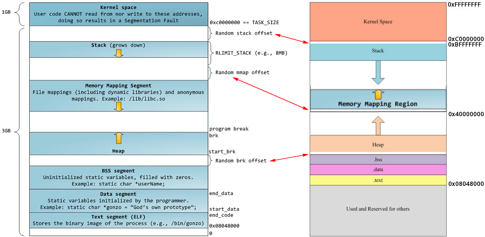

### 概述
> 一个进程在运行过程中，具体哪一些数据需要维护在内存中呢？这些数据又是怎么布局的呢？

> 在Linux中进程维护的是虚拟地址，那么虚拟地址怎么去映射到物理地址呢？

> 在Linux的进程中，进程会认为自己独享内存空间。

### 虚拟地址
在Linux，Windows等操作系统中，为什么不直接使用Physical Address（物理地址），而要用Virtual Address（虚拟地址）呢（在intel的手册中也被称为Linear Address，具体原因请参考这篇文章）？
因为使用虚拟地址可以带来诸多好处：
* 在支持多进程的系统中，如果各个进程的镜像文件都使用物理地址，则在加载到同一物理内存空间的时候，可能发生冲突。
* 直接使用物理地址，不便于进行进程地址空间的隔离。
* 物理内存是有限的，在物理内存整体吃紧的时候，可以让多个进程通过分时复用的方法共享一个物理页面（某个进程需要保存的内容可以暂时swap到外部的disk/flash），这有点类似于多线程分时复用共享CPU的方式。
#### 物理地址&逻辑地址&线性地址
* 物理地址：加载到内存地址寄存器中的地址，内存单元的真正地址。
* 虚拟地址（线性地址）：这是对整个内存（不要与机器上插那条对上号）的抽像描述。分页机制是一种实现。
* 逻辑地址：机器语言指令中出现的内存地址，都是逻辑地址，需要转换成线性地址，再经过MMU(CPU中的内存管理单元)转换成物理地址才能够被访问到。分段机制。

操作系统中地址是逻辑地址-线性地址-物理地址，线性地址一般是分段机制，在Linux操作系统中，没有使用分段地址，使用的是分页机制。  

Linux中逻辑地址等于线性地址。为什么这么说呢？因为Linux所有的段（用户代码段、用户数据段、内核代码段、内核数据段）的线性地址都是从 0x00000000 开始，长度4G，这样 线性地址=逻辑地址+ 0x00000000，也就是说逻辑地址等于线性地址了。

#### 分页机制
可以参考系列文章，是目前看到讲的最深入的文章。[虚拟地址转化](https://zhuanlan.zhihu.com/p/65298260)

* 一个页大小通常是4K。
* 虚拟地址包括：页号+页内偏移量
* 页表(PT,page table)存储的是虚拟页号与物理页号对应关系，有了物理页号，根据虚拟地址中的页内偏移也就可以找到具体的物理地址(虚拟&物理页内偏移是一致的)。
* 页表是进程私有的。
* 根据虚拟地址寻到页表中的物理地址是通过MMU来实现的，后续会讲到。
* 目前采用4k页的话，32位的页表需要4M，100个进程就400M，64位则更为恐怖，目前操作系统是通过多级页表来实现。
  
#### MMU&TLB&PT
MMU是处理器/核（processer）中的一个硬件单元，通常每个核有一个MMU。MMU由两部分组成：TLB(Translation Lookaside Buffer)和table walk unit。  

因为访问内存中的页表相对耗时，尤其是在现在普遍使用多级页表的情况下，需要多次的内存访问，为了加快访问速度，系统设计人员为page table设计了一个硬件缓存 - TLB，CPU会首先在TLB中查找，因为在TLB中找起来很快。  

pagetable如下图所示，通过VPN(虚拟页号)，可以查找到具体的物理页。其中每一行我们成为entity。其实TLB的数据结构与这个类似，如果TLB中的valid是0则来pt中找，如果pt中valid是0，说明该物理页pt也没有分配，则交给应用去做页面分配。


#### 多级页表
上面有讲到PT，我们现在操作系统中大多数是多级页表的实现，Linux中32位是2级页表，64位是4级页表。一个进程往往使用的内存有限，从pagetable的结构中可以看到，实际上没有物理页对应的也会维护VPN的entity，维护VPN的内存也是很大的。所以有了多级页表的实现。

多级页表第一级别的目录存储，指向下一级目录的物理地址起始物理地址。再加上下一级目录的偏移量就可得到目录中的某一行的物理地址。最后一级就是页表，可以查找到具体物理页的起始物理地址。例如32位的2级页表如下：
  

如果存储4K * 1024 * 16 = 64M的空间，那么最后一级别的页目录只有16个页表，16 * 4k，再加上PD页目录4k的存储空间。16以后页表是地址不够时再分配。可以理解，当前进程共享4G的虚拟地址，但是实际上用到内存有限，页表本身是稀疏结构，采用层级模式，减少了存储空间。  

二级目录的地址在上级目录中可以获取，那么顶级目录的物理地址存储存储在哪里呢？在进程初始化时就进行了初始化。

64位的采用了4级页表，如下图所示：
  

多级页表的使用，减少了页表的存储，不过也提高了地址转化过程对于内存的访问次数。有的操作系统实现采用大表（大于4K）的方式。


### 进程的内存数据
#### 用户态和内核态划分
整个虚拟内存空间要一分为二，一部分是用户态地址空间，一部分是内核态地址空间，那这两部分的分界线在哪里呢？进程的内存存储是在`struct mm_struct *mm` 来管理的，其中有一个变量`unsigned long task_size`来定义用户进程的使用空间。  

其中32位操作系统定义的值为：`0xC0000000` ，64位操作系统虚拟地址只使用了48位，其中task_size的值为：`((1UL << 47) - PAGE_SIZE)` ，1左移动47位，减去一个页的大小(4k，0x1000)，0x00007FFFFFFFF000。内核空间为1G。

所以32位操作系统的用户空间位0x00000000~0xC0000000，共3G空间。64位操作系统，0x0000000000000000～0x00007FFFFFFFF000，共128T。内核态也位128T（最高的48位空间），中间存在较大的内存缝隙，做隔离。

如下图：


#### 用户态内存布局
```

unsigned long mmap_base;  /* 虚拟地址空间中用于内存映射的起始地址 base of mmap area */
unsigned long total_vm;    /* 总共映射的页数 */
unsigned long locked_vm;  /* 锁定不能换出的页数 */
unsigned long pinned_vm;  /* 不能换出页不能移动的页数 */
unsigned long data_vm;    /* 存放数据页数 VM_WRITE & ~VM_SHARED & ~VM_STACK */
unsigned long exec_vm;    /* 存放可执行文件页数 VM_EXEC & ~VM_WRITE & ~VM_STACK */
unsigned long stack_vm;    /*栈的页数 VM_STACK */
// start_code,end_code代码区的起始页，start_data，end_data数据区的起始页
unsigned long start_code, end_code, start_data, end_data;
//start_stack 是栈的起始位置，栈的结束位置在寄存器的栈顶指针中
//start_brk，brk 堆的起始结束位置
unsigned long start_brk, brk, start_stack;
//arg_start，arg_end参数的起始截止位置，env_start, env_end系统变量的起始结束位置
unsigned long arg_start, arg_end, env_start, env_end;
```


