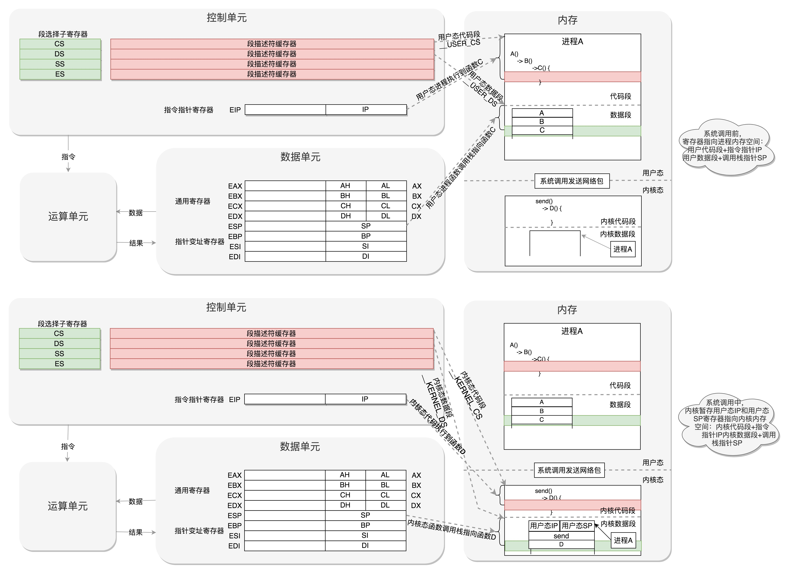
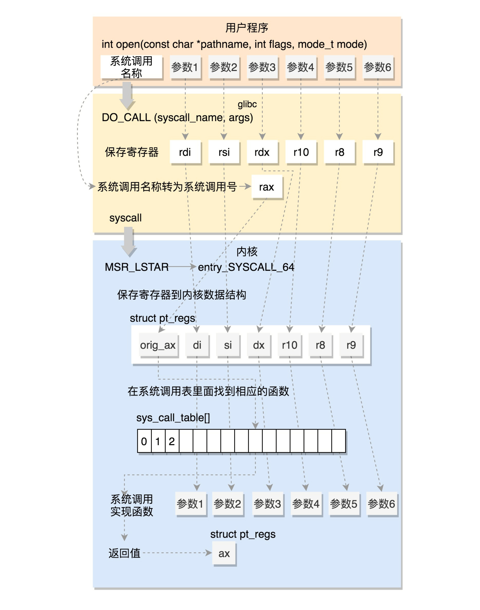

### 进程的概念
在计算机知识体系中，我们了解进程是资源分配的最小单位，线程是资源调度的最小单位。资源分配，指的是进程可以独占内存，文件，设备等系统资源。资源调度的话，往往指的是cpu的调度。
在Linux中，线程是轻量级的进程。

### 内核态与用户态
>现代计算机系统中，所有的硬件资源都是由操作系统负责管理的，硬件资源包括 CPU 的使用时间、物理内存的使用、硬盘的读写等等。

>操作系统内核当然是工作在内核态下，普通的用户进程工作在用户态下。处于内核态的操作系统内核对于硬件有不受限制的使用权限，并且可以执行任何 CPU 指令以及访问任意的内存地址。而用户态进程没有能力直接操作硬件，也没有能力访问任意的内存地址空间。用户态进程只能通过操作系统内核提供的系统调用受限地使用硬件资源。并且用户态进程不能执行一些 CPU 特权指令。系统调用属于内核空间代码，而用户态进程运行在用户态，所以执行系统调用时，程序的执行流程要从用户态切换到内核态。

>早期 Linux 通过中断的方式实现系统调用，中断号为 0x80。从用户态切换到内核态的代价是，首先要进行现场保护，即保存当前用户态的状态，以便执行完系统调用后恢复；其次是要从用户堆栈切换到内核堆栈；接着执行 0x80 号中断对应的中断处理程序，再通过中断处理程序找到相应的系统调用代码。系统调用执行完毕后又要切换堆栈、恢复现场。新的CPU提供了专门用于系统调用的 sysenter 和 sysexit 指令，使得系统调用的执行速度更快更高效。

### 运行级别

>内核态与用户态是操作系统的两种运行级别，跟intel cpu没有必然联系，intel cpu提供Ring0-Ring3三种级别运行模式，Ring0级别最高，Ring3级别最低。Linux使用了Ring3级别运行用户态。Ring0作为内核态，没有使用Ring1和Ring2。Ring3不能访问Ring0的地址空间，包括代码和数量。

>Linux进程的4GB空间(32位)，3G-4G部分大家是共享的，是内核态的地址空间，这里存放在整个内核代码和所有的内核模块，以及内核所维护的数据。用户运行一程序，该程序所创建的进程开始是运行在用户态的，如果要执行文件操作，网络数据发送等操作，必须通过write，send等系统调用，这些系统会调用内核中的代码来完成操作，这时，必须切换到Ring0，然后进入3GB-4GB中的内核地址空间去执行这些代码完成操作，完成后，切换Ring3，回到用户态。这样，用户态的程序就不能随意操作1内核地址空间，具有一定的安全保护作用

### 系统调用
用户态进程调用内核态功能，是通过系统调用来实现，代码中linux提供了glibc这样的底层api运行库来支持。

#### 用户态内核态切换
从用户态到内核态切换可以通过三种方式：
* 系统调用：其实系统调用本身就是中断，但是软件中断，跟硬中断不同。
* 异常：如果当前进程运行在用户态，如果这个时候发生了异常事件，就会触发切换。例如：缺页异常。
* 外设中断：当外设完成用户的请求时，会向CPU发送中断信号。

切换过程：用户态 - 系统调用 - 保存寄存器 - 内核态执行系统调用 - 恢复寄存器 - 返回用户态，然后接着运行

32位系统调用过程

64位系统调用过程

#### 是否进程切换
系统调用是不进行进程切换的，每个进程都拥有两个堆栈：用户空间的堆栈和内核空间堆栈  

用户进程：执行用户空间的代码的程序，使用用户堆栈  

系统进程：执行内核空间代码（系统调用或中断）的程序，使用内核堆栈（系统堆栈）  

这里的用户进程和系统进程使用同一个PCB，他们并不是两个实体进程，而是同一个进程的两个侧面。当调用系统调用或发生中断时，CPU切换到内核态，用户进程“变身”系统进程，此时的寄存器上下文保存在系统进程的堆栈上，以便系统调用返回后的恢复。
