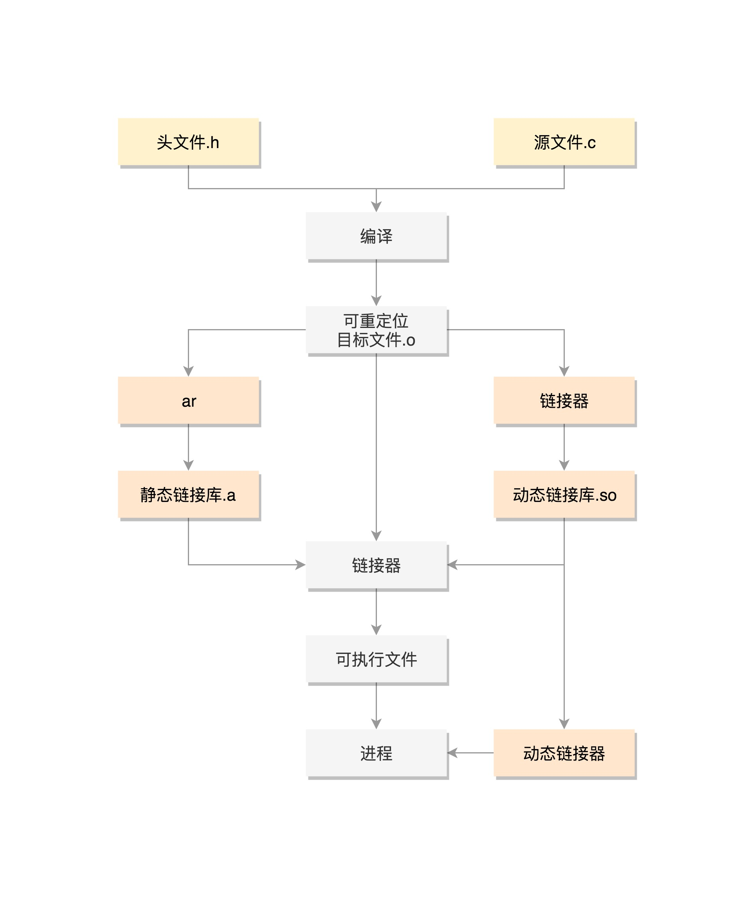

### ELF概念

>对于计算机，CPU只能识别二进制文件，对于二进制文件，不同的操作系统会有不同的规范。我们运行在Linux的上代码需要编译后，系统才能识别。在Linux中二进制文件规范为ELF（Executeable and Linkable Format，可执行与可链接格式）

### 编译与链接过程


整个过程如上图所示，在编译的时候，先做预处理工作，例如将头文件嵌入到正文中，将定义的宏展开，然后就是真正的编译过程，最终编译成为.o 文件。然后通过静态链接或动态链接形成可执行文件ELF。

### 编译
>编译器能够识别代码中的词汇、句子以及各种特定的格式，并将他们转换成计算机能够识别的二进制形式，这个过程称为编译（Compile）,编译形成的是可重定位的目标文件(.o)。

>C语言的编译器有很多种，不同的平台下有不同的编译器，Linux 下常用的是 GUN 组织开发的 GCC，很多 Linux 发行版都自带 GCC。

#### 编译过程
整个编译过程比较复杂，主要包括以下几个过程(参考：[编译和链接](https://www.cnblogs.com/linhaostudy/p/8808967.html#autoid-2-0-0))：  


* 词法分析   
  >首先源代码程序被输入到扫描器( Scanner),扫描器的任务很简单,它只是简单地进行词法分析,运用一种类似于有限状态机( Finite State Machine)的算法可以很轻松地将源代码的字符序列分割成一系列的记号( Token)。
* 语法分析  
  >由扫描器产生的记号进行语法分析,从而产生语法树( Syntax Tree)。
* 语义分析  
  >语法分析仅仅是完成了对表达式的语法层面的分析,但是它并不了解这个语句是否真正有意义。比如C语言里面两个指针做乘法运算是没有意义的,但是这个语句在语法上是合法的;比如同样个指针和一个浮点数做乘法运算是否合法等。编译器所能分析的语义是静态语义( Static Semantic),所谓静态语义是指在编译期可以确定的语义,与之对应的动态语义( Dynamic Semantic)就是只有在运行期才能确定的语义。

  >静态语义通常包括声明和类型的匹配,类型的转换。动态语义一般指在运行期出现的语义相关的问题,比如将0作为除数是一个运行期语义错误。
* 中间语言生成
  >在把一个源程序翻译成目标代码的过程中，一个编译器可能构造出一个或多个中间表示。这些中间表示可以有多种形式。语法树是一种中间表示形式，它们通常在语法分析和语义分析中使用。 

  >现代的编译器有着很多层次的优化,往往在源代码级别会有一个优化过程。     

  >中间代码使得编译器可以被分为前端和后端。编译器前端负责产生机器无关的中间代码,编译器后端将中间代码转换成目标机器代码。这样对于一些可以跨平台的编译器而言,它们可以针对不同的平台使用同一个前端和针对不同机器平台的数个后端。
  
  >（我的理解是，在生成机器码之前，会先生成中间语言，编译器会在中间语言做一定的优化，也会在机器码层面做一定的优化，机器码层面优化是在目标代码生成过程中）
* 目标代码生成与优化
  >编译器后端主要包括代码生成器( Code Generator)和目标代码优化器( Target Code Optimizer)。

  
经过这些扫描、语法分析、语义分析、源代码优化、代码生成和目标代码优化,编译器忙活了这么多个步骤以后,源代码终于被编译成了目标代码。但是这个目标代码中有一个问题是:indeⅹ和aray的地址还没有确定。如果我们要把目标代码使用汇编器编译成真正能够在机器上执行的指令,那么 index和aray的地址应该从哪儿得到呢?如果 index和array定义在跟上面的源代码同一个编译单元里面,那么编译器可以为 index和array分配空间,
确定它们的地址:那如果是定义在其他的程序模块呢?

一个看似简单的问题引出了我们一个很大的话题:目标代码中有变量定义在其他模块该怎么办?事实上,定义其他模块的全局变量和函数在最终运行时的绝对地址都要在最终链接的时候才能确定。所以现代的编译器可以将一个源代码文件编译成一个未链接的目标文件,然后由链接器最终将这些目标文件链接起来形成可执行文件

#### 目标代码结构
> 在编译的时候，先做预处理工作，例如将头文件嵌入到正文中，将定义的宏展开，然后就是真正的编译过程，最终编译成为.o 文件，这就是 ELF 的第一种类型，可重定位文件  


ELF 文件的头是用于描述整个文件的。这个文件格式在内核中有定义，分别为 struct elf32_hdr 和 struct elf64_hdr。接下来是一个一个的 section，也叫节。这里面的名字有点晦涩，不过你可以猜一下它们是干什么的。这个编译好的二进制文件里面，应该是代码，还有一些全局变量、静态变量等等。
* .text：放编译好的二进制可执行代码
* .data：已经初始化好的全局变量
* .rodata：只读数据，例如字符串常量、const 的变量
* .bss：未初始化全局变量，运行时会置 0
* .symtab：符号表，记录的则是函数和变量
* .strtab：字符串表、字符串常量和变量名
* .rel.text：与重定位有关
* .rel.data：与重定位有关

----
### 链接

这个编译好的代码和变量，将来加载到内存里面的时候，都是要加载到一定位置的。比如说，调用一个函数，其实就是跳到这个函数所在的代码位置执行；再比如修改一个全局变量，也是要到变量的位置那里去修改。但是现在这个时候，还是.o 文件，不是一个可以直接运行的程序，这里面只是部分代码片段。  

示例代码：
```
    #include <stdio.h>
    #include <stdlib.h>
    #include <sys/types.h>
    #include <unistd.h>
    
    extern int create_process (char* program, char** arg_list); 
    int create_process (char* program, char** arg_list)
    {
        pid_t child_pid;
        child_pid = fork ();
        if (child_pid != 0)
            return child_pid;
        else {
            execvp (program, arg_list);
            abort ();
        }
   }
```
```
#include <stdio.h>
#include <stdlib.h>
#include <sys/types.h>
#include <unistd.h>

extern int create_process (char* program, char** arg_list);

int main ()
{
    char* arg_list[] = {
        "ls",
        "-l",
        "/etc/yum.repos.d/",
        NULL
    };
    create_process ("ls", arg_list);
    return 0;
}
```
以上代码为示例，在调用create_process时，并不清楚create_process的具体位置，那么如何进行链接呢，重定位。主要两种方式，静态重定位和动态重定位，也就是我们常常讲的静态链接和动态链接。

#### 静态链接
 * a. main中调用了create_process，此时create_process在另一个类里，并不清楚它具体的位置。在.rel.text标注需要重定位  

 * b. 要想让 create_process 这个函数作为库文件被重用，不能以.o 的形式存在，而是要形成库文件，最简单的类型是静态链接库.a 文件（Archives），仅仅将一系列对象文件（.o）归档为一个文件，使用命令 ar 创建。`
ar cr libstaticprocess.a process.o`

 * c. 当有程序要使用这个静态连接库的时候，会将.o 文件提取出来，链接到程序中。形成二进制执行文件。 

  
最终形成的文件格式如下：

>这个格式和.o 文件大致相似，还是分成一个个的 section，并且被节头表描述。只不过这些 section 是多个.o 文件合并过的。但是这个时候，这个文件已经是马上就可以加载到内存里面执行的文件了，因而这些 section 被分成了需要加载到内存里面的代码段、数据段和不需要加载到内存里面的部分，将小的 section 合成了大的段 segment，并且在最前面加一个段头表（Segment Header Table）。在代码里面的定义为 struct elf32_phdr 和 struct elf64_phdr，这里面除了有对于段的描述之外，最重要的是 p_vaddr，这个是这个段加载到内存的虚拟地址。  
在 ELF 头里面，有一项 e_entry，也是个虚拟地址，是这个程序运行的入口。


静态链接库一旦链接进去，代码和变量的 section 都合并了，因而程序运行的时候，就不依赖于这个库是否存在。但是这样有一个缺点，就是相同的代码段，如果被多个程序使用的话，在内存里面就有多份，而且一旦静态链接库更新了，如果二进制执行文件不重新编译，也不随着更新。因而就出现了另一种，动态链接库（Shared Libraries），

#### 动态链接
动态链接库，就是 ELF 的第三种类型，共享对象文件（Shared Object）。

首先，多了一个.interp 的 Segment，这里面是 ld-linux.so，这是动态链接器，也就是说，运行时的链接动作都是它做的。另外，ELF 文件中还多了两个 section，一个是.plt，过程链接表（Procedure Linkage Table，PLT），一个是.got.plt，全局偏移量表（Global Offset Table，GOT）。  


动态链接过程：
* 调用create_process 函数。由于是运行时才去找，编译的时候，压根不知道这个函数在哪里，所以就在 PLT 里面建立一项 PLT[x]，也会为 create_process 函数创建一项 GOT[y]。这一项是运行时 create_process 函数在内存中真正的地址。但是这里面没有真正的地址。
* 运行时GOT[y]回调PLT[0]，PLT[0]转而调用 GOT[2]，这里面是ld-linux.so的入口函数，这个函数会找到加载到内存中create_process函数的地址，然后把这个地址放在 GOT[y]里面。下次，PLT[x]的代理函数就能够直接调用了。