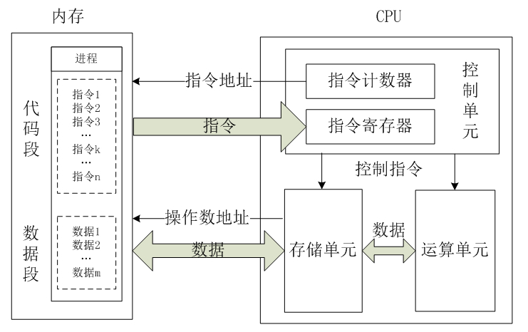

学习X86体系，主要为了简单了解一下操作系统，方便对于上层技术架构体系有更好的理解。主要学习途径：https://time.geekbang.org/column/intro/164
第一次读这文章并不能很好的理解，只能泛泛的翻看一下，简单总结一点可以用的到的知识。

### x86的故事
x86架构于1978年推出的Intel 8086中央处理器中首度出现，它是从Intel 8008处理器中发展而来的，而8008则是发展自Intel 4004的。8086在三年后为IBM PC所选用，之后x86便成为了个人电脑的标准平台，成为了历来最成功的CPU架构。
那为什么IBM PC 所选后就成为历来最成功的CPU架构？
IBM PC是IBM公司试图在以Apple II和坦迪公司（Tandy）的TRS-80为主的家用电脑的市场立足的结果。当时在家用电脑市场上除上述的两种电脑外还有一系列CP/M机。由于此前IBM传统的设计过程就已经证明无法用来设计廉价的微型计算机（比如很失败的IBM 5100），因此IBM决定破例设置一个特别小组。这个小组被授命绕过公司的规则来快速地提供一个市场产品。这个项目的代号叫做“象棋项目”（Project Chess）。在唐·埃斯特利奇领导下的12人小组用了约一年的时间研制出了IBM PC。为了达到这个目的他们首先决定使用现成的、不同原始设备制造商的组件。这个做法与IBM过去始终研制自己的组件的做法相反。其次他们决定使用开放结构，这样其它生产商可以生产和出售兼容的组件和软件。IBM还出售其《IBM PC技术参考资料》，这份资料中包括一段ROMBIOS源代码。

### x86架构
维基百科：X86架构（The X86 architecture）是微处理器执行的计算机语言指令集，指一个intel通用计算机系列的标准编号缩写，也标识一套通用的计算机指令集合。该系列较早期的处理器名称是以数字来表示80x86。由于以“86”作为结尾，包括Intel 8086、80186、80286、80386以及80486，因此其架构被称为“x86”。由于数字并不能作为注册商标，因此Intel及其竞争者均在新一代处理器使用可注册的名称，如Pentium。现时英特尔将其称为IA-32，全名为“Intel Architecture, 32-bit”，一般情形下指代32位的架构。

也就是说X86是一系列的cpu，也标识一套通用的计算机指令集合。

##### CPU架构

控制单元：控制单元是整个CPU的指挥控制中心，由程序计数器PC（Program Counter）, 指令寄存器IR(Instruction Register)、指令译码器ID(Instruction Decoder)和操作控制器OC(Operation Controller)等，对协调整个电脑有序工作极为重要。它根据用户预先编好的程序，依次从存储器中取出各条指令，放在指令寄存器IR中，通过指令译码(分析)确定应该进行什么操作，然后通过操作控制器OC，按确定的时序，向相应的部件发出微操作控制信号。操作控制器OC中主要包括节拍脉冲发生器、控制矩阵、时钟脉冲发生器、复位电路和启停电路等控制逻辑。

运算单元：是运算器的核心。可以执行算术运算(包括加减乘数等基本运算及其附加运算)和逻辑运算(包括移位、逻辑测试或两个值比较)。相对控制单元而言，运算器接受控制单元的命令而进行动作，即运算单元所进行的全部操作都是由控制单元发出的控制信号来指挥的，所以它是执行部件。

存储单元：包括CPU片内缓存和寄存器组，是CPU中暂时存放数据的地方，里面保存着那些等待处理的数据，或已经处理过的数据，CPU访问寄存器所用的时间要比访问内存的时间短。采用寄存器，可以减少CPU访问内存的次数，从而提高了CPU的工作速度。但因为受到芯片面积和集成度所限，寄存器组的容量不可能很大。寄存器组可分为专用寄存器和通用寄存器。专用寄存器的作用是固定的，分别寄存相应的数据。而通用寄存器用途广泛并可由程序员规定其用途，通用寄存器的数目因微处理器而异。这个是我们以后要介绍这个重点，这里先提一下。

控制单元在时序脉冲的作用下，将指令计数器里所指向的指令地址(这个地址是在内存里的)送到地址总线上去，然后CPU将这个地址里的指令读到指令寄存器进行译码。对于执行指令过程中所需要用到的数据，会将数据地址也送到地址总线，然后CPU把数据读到CPU的内部存储单元(就是内部寄存器)暂存起来，最后命令运算单元对数据进行处理加工。

##### 指令集
推荐一个文章可以了解到复杂指令集与精简指令集的不同之处。[ARM和X86架构](https://zhuanlan.zhihu.com/p/21266987)
