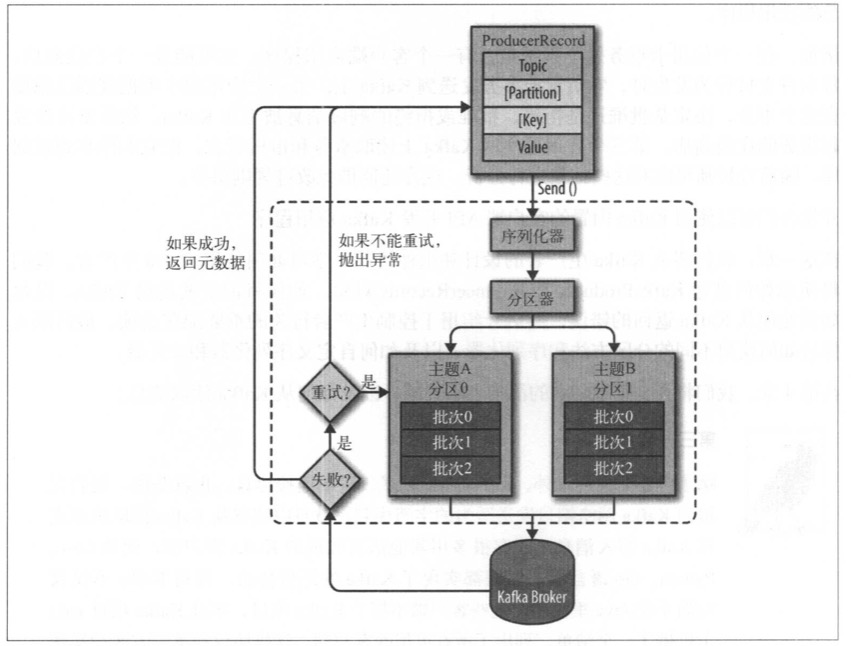
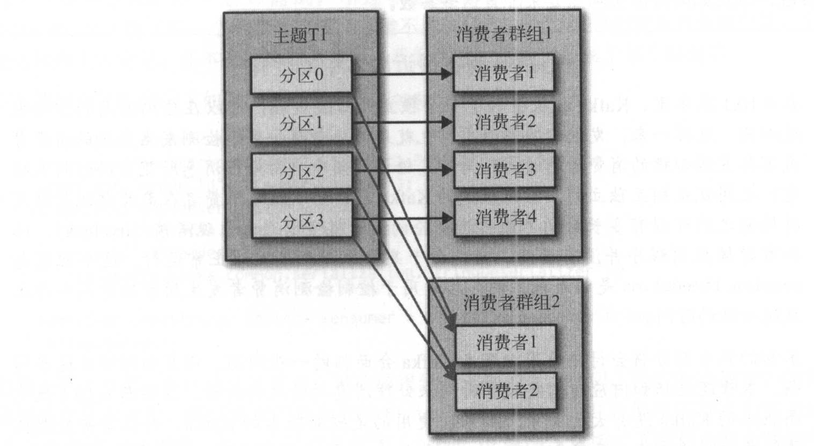
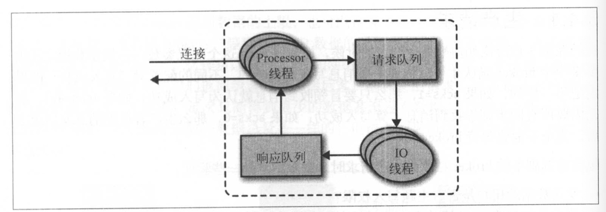
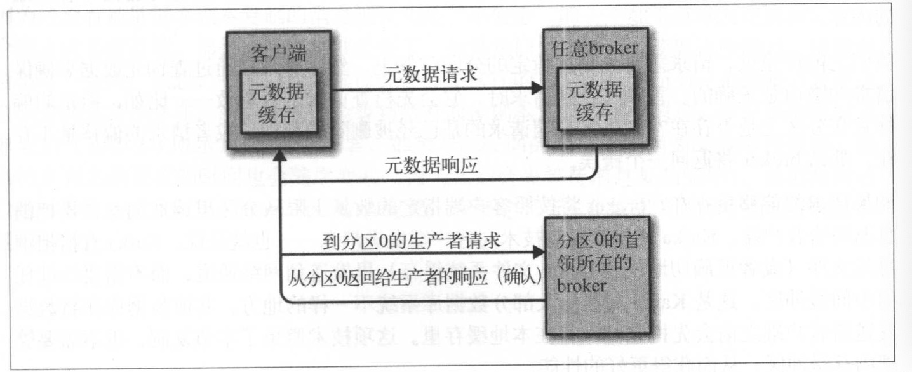
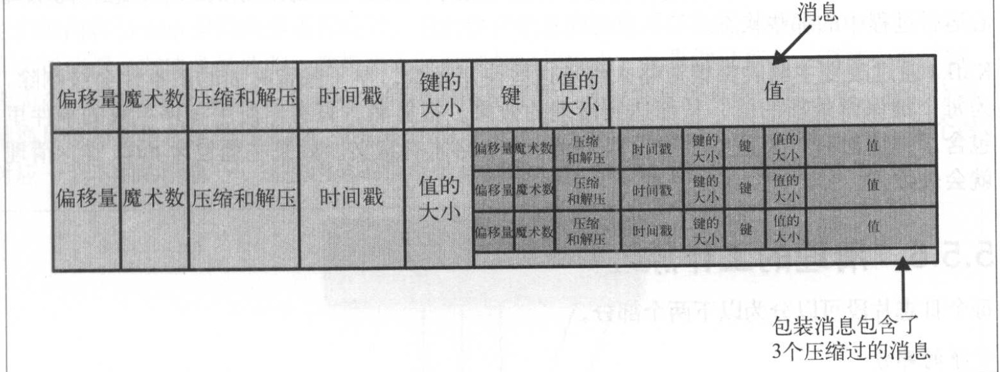

### 生产者
#### 基本组件图

#### 创建生产者的基本参数
参数|概念
-|-
bootstrap.servers|broker的地址清单，host:port，不需要所有的broker地址，生产者会从broker中得到其它broker的地址，不过建议至少两个
key.serializer|key的序列化方式，例如我们采用org.apache.kafka.common.serialization.StringSerializer
val.serializer|value的序列化方式，例如我们采用org.apache.kafka.common.serialization.ByteArraySerializer

kafka默认只提供了，ByteArraySerializer、StringSerializer、IntegerSerializer三种实现，我们也可以自定义的序列化，例如开源的Avro、 Thrift或 Protobuf
[美团序列化文章](https://tech.meituan.com/2015/02/26/serialization-vs-deserialization.html)
[常见的序列化工具](https://blog.csdn.net/John8169/article/details/80906755)

#### 消息发送模式
* 发送并忘记：把消息发送给服务器，并不关心服务器是否收到消息
* 同步发送：send()返回一个Future对象，get()方法得到响应，如果消息发送后服务器返回错误get方法捕获错误。发送前或发送中，send方法可直接捕获错误。
* 异步发送：调用send()方法并指定一个回调函数，回调函数实现CallBack接口的onCompletion(RecordMetadata metadata, Exception exception)方法。

#### 生产者的配置
参数|概念
-|-
acks|0,1,all。必须多少个分区副本写入成功才认为是写入成功。
buffer.memory|生产者内存缓冲区大小，如果生产消息速度大于发送到服务端速度，那么缓存可能被填满，send方法会先被阻塞，阻塞到一定时间，会抛异常。阻塞时间由max.block.ms控制。
max.block.ms|在上面buffer.memory已经讲述
compression.type|默认情况下，消息发送时不会被压缩。该参数可以设置为snappy、gzip或lz4
retries|重试次数，生产者从服务器收到错误可能是临时性错误，retries决定了重发消息的次数，默认重试间隔100ms，可通过retry.backoff.ms控制
batch.size|当多个消息发送到同一个分区时，生产者会把这些消息放到同一个批次中。该参数表示：一个批次可使用的内存大小，单位字节。
linger.ms|发送批次之前等待的时间，生产者会在batch.size满或者等待时间达到linger.ms，发送批次数据
max.request.size|发送请求的最大，一次请求可以是单消息，也可以是一批次。broker端也有自己限制，最好配置相同。
receive.buffer.bytes|tcp socket接受数据包缓冲区大小
send.buffer.bytes|tcp socket发送数据包缓冲区大小
client.id|服务器会用它来标示消息来源
max.in.flight.requests.per.connection|生产者收到服务器响应之前，可以发送多少个消息，设为1可以保证消息顺序写入服务器
request.timeout.ms|生产者在发送数据时等待服务器的响应时间
metadata.fetch.timeout.ms|生产者从服务器获取元数据时，等待响应时间
timeout.ms|broker等待同步副本返回消息确认的时间

> 顺序行保证，kafka可以保证分区的顺序性，不过如果retries大于0，max.in.flight.requests.per.connection大于1时候，如果第一批数据写入失败发生重试，第二批数据写入成功，那么就不能保证顺序行了。高可用系统中重试是一定要做的，那么可把max.in.flight.requests.per.connection设置为1保证顺序性。

#### 分区
默认分区策略，key为null时采用轮询算法，把消息随机发送到主题内各个可用分区。key不为null时采用散列(哈希)方式将消息映射到特定分区，此时相同的key必定在同一个分区。
自定义分区策略，可以通过实现Partitioner接口自定自己的分区策略，例如想把某一个客户分配到一个分区，其它客户消息分配到剩余N-1个分区中

---
### 消费者
#### 消费者和消费者群组
Kafka消费者从属于消费者群组，一个群组里的消费者订阅的是同一个或者多个主题，每个消费者接收主题的一部分分区。往群组里添加消费者是横向伸缩的主要手段，当消费者多于分区数量时，多于的消费者会被重置。

#### 再均衡
分区的所有者从一个消费者转移到另一个消费者，这样的行为叫做“再均衡”。它为消费者群组带来了高可用和伸缩性。再均衡期间，消费者无法读取消息，会造成群组一小段时间不可用。后续会讨论如何避免不必要的再均衡。
往群组添加消费者，消费者关闭，分区数量发生变化都会引起“再均衡”。
消费者通过向“群组协调器”broker，发送心跳，来维持它跟群组、分区的关系。消费者以正常的时间间隔发送心跳就认为它是活跃的。
当消费者要加入群组时，第一个加入群组的消费者会成为“群主”，群主从“群组协调器”获取消费者列表，采用分配策略为消费者分配分区。
>旧版（低于0.10.1版本）kafka的心跳是跟随着消息轮询/提交偏移量一起的，这样会存在一些问题（后续说明）。新版是一个单独的线程进行心跳消息提交。

#### 创建消费者
消费者的创建跟生产者的创建类似。
参数|概念
-|-
bootstrap.servers|broker的地址清单，host:port，不需要所有的broker地址，消费者会从broker中得到其它broker的地址，不过建议至少两个
key.serializer|key的序列化方式，例如我们采用org.apache.kafka.common.serialization.StringSerializer
val.serializer|value的序列化方式，例如我们采用org.apache.kafka.common.serialization.ByteArraySerializer
group.id|消费者群组，非必须，建议要填写
#### 订阅主题
消费者可以订阅一个或者多个主题数据，如果订阅多个，需要有处理多个主题数据的能力。`consumer.subscribe(list/正则)`。
#### 轮询
consumer.poll(100)，poll可以指定一个参数单位是毫秒，表示阻塞时间（消费者缓冲区里没有数据时，发生阻塞），如果设置为0，则立即返回，否则在指定时间内一直等待broker返回数据。
poll方法返回一个记录列表，每一行数据里保存了，该数据的主题、分区、偏移量、数据的key/value。
消费者轮询不仅仅是获取数据，同时也会从群组协调者获取分区、分区再均衡、发送心跳等。

#### 从指定偏移量处理数据
kafka提供了seekToBeginning，seekToEnd，seek(partition,offset)方法，指定轮询开始偏移量。例如客户端防止重复提交，在自己库里存储offset，保证没次重分区时，从库里获取最后一次偏移量，从指定偏移量进行提交。seek()方法只能更新我们正在使用的位置，在下一次调用poll()时就可以获得正确的消息。如果 seek()发生错误(比如偏移量不存在)，poll()就会抛出异常。

#### 提交偏移量
kafka的设计更新分区当前位置，是通过消费者提交偏移量来实现的。具体实现消费者往一个_consumer_offset的特殊主题发送数据。如果发生再均衡，那么一个分区新的消费者就会从最后一次提交的偏移量开始消费，如果最后提交的偏移量消费者消息没有处理，那么会造成消息丢失，如果已经处理，那么会造成重复消费。kafka consumer api提供了多种方式来提交偏移量。
##### 自动提交
自动提交参数设置：enable.auto.commit，如果设置为true就会开启自动提交功能，默认每5s，把poll()获取到的最大偏移量进行提交。间隔时间也可以通过参数auto.commit.interval.ms控制。
自动提交，如果轮询后的消息处理比较慢，那么可能会有提交比较大的偏移量的风险。
##### 手动提交
手动提交可以同步/异步提交，分别对应commitSync，commitAsync。同步提交，消费者会一直等待commitSync方法执行成功，这个会影响吞吐量。异步提交失败不会进行重试，如果一次网络抖动，失败后，总会有一个更大的offset进行提交，同时也提供一个回调接口，当收到broker通知(异常/正确)时进行的处理，可以记录offset，打印日常等等。
在关闭消费者或者再均衡前的一次提交，可以采用异步提交捕获错误同步提交的方式，保证最后一次提交成功。
手动提交时也可以指定分区、偏移量，例如一次轮询的消息特别多，防止发生再均衡时处理的重复消息过多，可以只消息处理的过程中，不断提交已经处理的偏移量。

#### 再均衡监视器
kafka为消费者提供了ConsumerRebalanceListener接口监视再均衡事件，onPartitionsRevoked方法监听再均衡之前，onPartitionsAssigned监听再均衡之后。

#### 主动退出
我们轮询时，我们会在一个无限循环里`while(true){}`，如何主动退出该循环呢？需要另一个线程调用consumer.wakeup()方法，该线程调用后，轮询线程poll会抛出WakeupException，主要最后在finally调用consume.close()方法还是很有必要的，它会提交任何还没有提交的东西 ，并向群组协调器发送消息，告知自己要离开群组，接下来就会触发再均衡 ，而不需要等待会话超时。

#### 反序列化
在讲生产者时，有讲过进行序列化，消费者需要对数据进行相同的反序列化。

#### 消费者配置
参数|概念
-|-
fetch.min.bytes|消费者从服务器获取的最小字节数，broker收到请求后等待消息达到该大小，返回给消费者。
fetch.max.wait.ms|指定broker的等待时间，默认是 500ms。如果没有足够的数据流入Kafka，消费者获取最小数据量的要求就得不到满足，最终导致500ms的延迟。 
max.partition.fetch.bytes|服务器从每个分区返回给消费者的最大字节数
session.timeout.ms|该属性指定了消费者在被认为死亡之前可以与服务器断开连接的时间，默认是3s。如果消费者没有在session.timeout.ms指定的时间内发送心跳给群组协调器，就被认为 已经死亡，协调器就会触发再均衡，把它的分区分配给群组里的其他消费者。
heatbeat.interval.ms|指定消费者poll方法向服务器发送心跳的间隔时间，一般是session.timeout.ms的三分之一
auto.offset.reset|指定消费者在读取一个没有偏移量或者偏移量失效的分区时该如何处理，默认是lastest，可配置earliest。
enable.auto.commit|是否自动提交偏移量，可通过auto.commit.interval.ms指定自动提交频率
partition.assignment.strategy|分区分配给消费者的分配策略，可以指定Range，连续分给同一个消费者；RoundRobin，逐个分配
client.id|消费者唯一标识
max.poll.records|单次poll最大记录数
receive.buffer.bytes 和 send.buffer.bytes|socket的的tcp缓冲区，-1为操作系统默认

---
### 深入kafka
本章主要讨论，kafka如何进行复制，如何处理生产者、消费者的请求，存储细节
#### 集群成员关系
* kafka使用zookeeper来维护集群成员的关系，每个broker有一个唯一性ID，在zk的brokers/ids/路径下创建临时节点来维护。
* 当创建一个节点，发现路径下已经存在一个相同的节点，会报错。
* 在broker停机或者网络问题或者因为GC停顿时间过长等场景下，broker会从zookeeper断开连接，zk上临时节点会被移除。
* broker在zk上移除后，它仍然可能存在于其它数据结构中，例如主题的副本列表，如果一个相同的brokerId上线，则会继承移除的broker的分区和主题。

#### 控制器
* 控制器实际上就是一个broker，除了一般broker的功能之外，还负责**分区首领的选举**。集群中第一个创建的broker会在zk中创建一个临时节点/controller，当其它broker创建时，会发现/controller已经存在，不再创建。
* 其它broker会watch该controller节点，如果监听到节点删除，其它节点将会创建/controller，第一个创建成功的会成为新的控制器。
* 新选出的控制器通过Zookeeper的条件递增操作获得一个全新的、数值更大的controller epoch。其他broker在知道当前controller epoch后，如果收到由控制器发出的包含较旧epoch的消息，就会忽略它们。通过这样的方式避免脑裂(两个节点同时认为自己是控制器)。
* 当控制器发现一个broker已经离开集群(通过watch的Zookeeper路径)，它就知道，那些失去首领的分区需要一个新首领(这些分区的首领刚好是在这个 broker上)。控制器遍历这些分区，并确定谁应该成为新首领。

#### 复制
* 首领副本，每个分区都有一个首领副本，为保证一致性，生产者、消费者请求都会经过这个副本。
* 跟随者副本，跟随者副本，不处理生产者/消费者消息，唯一任务是复制首领副本消息，当首领副本broker发生崩溃时，其中一个会成为新首领。
* 首选首领，创建主题时配置的首领就是首选首领，默认情况下，Kafka的auto.leader·rebalance.enable 被设为true，它会检查首选首领是不是当前首领  如果不是，并且该副本是同步的，那么就会触发首领选举，让首选首领成为当前首领。
* 同步副本，持续请求得到最新消息的副本。

跟随者向首领发送获取数据的请求，这种请求与消费者为了读消息而发送的请求是一致的，一个跟随者副本请求消息1，消息2，消息3，在收到这3个请求的响应之前，它是不会发送第4个请求消息的。如果跟随者发送了请求消息4，那么首领就知道它已经收到了前面3个请求的响应。 如果一个副本10S内没有请求消息，就认为是不同步的。
#### 处理请求
broker大部分时间在处理客户端(生产者/消费者)、分区副本、控制器发送给分区首领的请求。kafka定义了一种基于tcp的二进制协议，约定了请求、响应的格式、错误场景等规范。broker按照请求到达的顺序来处理消息。

broker会在他监听的每一个端口运行一个acceptor线程，建立连接。并把请求交给Processor线程(网络线程)来处理，网络线程从客户端获取请求，并把他们放入请求队列，IO线程负责处理请求，把处理好的响应放入响应队列，Processor线程从响应队列里拿数据给到客户端。

客户端怎么知道往哪里发数据呢？客户端使用了另一种请求类型，也就是元数据请求。这种请求包含了客户端感兴趣的主题列表。服务器端的响应消息里指明了这些主题所包含的分区、每个分区都有哪些副本，以及哪个副本是首领。元数据请求可以发送给任意一个broker，因为所有broker都缓存了这些信息。客户端会缓存这些信息，并定期更新缓存。

消息格式、acceptor线程、processor线程、请求队列、IO线程、响应队列、元数据信息、元数据信息缓存
##### 生产者请求
###### ack
如果1或者all，响应消息会在一个**炼狱的缓冲区**，知道消息复制成功，返回给客户端。

>在Linux操作系统中，消息被写入文件系统缓存中，不保证可以什么时间刷新到磁盘。

##### 获取请求
客户端通过查询元数据来确保请求的路由是正确的。首领在收到请求时，它会先检查请求是否有效一一比如，指定的偏 移量在分区上是否存在?如果客户端请求的是已经被删除的数据，或者请求的偏移量不存在，那么broker将返回一个错误。
Kafka使用零复制技术向客户端发送消息一一也就是说， Kafka直接把消息从文件(或者更确切地说是 Linux文件系统缓存)里发送到网络通道。

broker设置返回数据的上下限，上限太高的话，客户端缓存占用太大，下限太小可能频繁进行网络传输。可以设置一个超时时间，多久数据没有积累到要求数量，就返回。

消费端也会等待分区消息写入ack副本，才能获取到数据，可以设置最大等待时间，replica.lag.time.max.ms。

##### 其它请求

#### 物理存储
##### 分区分配
* broker平均的分配分区
* 每个分区的每个副本尽量不在同一个broker
* 如果配置了机架信息，每个分区的每个副本

分配时，先每个broker轮询的分配首领分区，然后再分配跟随副本，例如broker1上分配了首领，复制系数为3，那么broker2，3，4分配跟随副本。如果有机架信息，类似，选下一个机架的broker。

分配完分区后，决定分区使用哪些目录，计算每个目录里的分区数量，新的分区总是被添加 到数量最小的那个目录里。
##### 文件管理
kafka不会无限保留数据，也不会等所有的消费者都读取后才删除数据。kafka为每个主题配置了数据保留期限或者数据的保留大小。
在一个大文件里查找和删除消息很费时，kafka把文件进行了分段，每一个小文件存储1G或者一周的数据，按照较小的那个来处理。
当前正在写入数据的片段，叫做活跃片段，活跃片段永远不会被删除。如果设置数据保留期限1天，活跃片段包含5天的数据，那么数据将会被保留。

##### 文件格式
生产者发送、服务端文件存储、消费者消费都采用了相同的文件格式，因此kafka可以采用零拷贝发送数据。
文件格式：[键、值、偏移量、消息大小、校验和、消息格式版本号、压缩算能 (Snappy、 GZip 或 LZ4)和时间戳]等。

如果采用了压缩，一次发送的消息格式越大，压缩性能就越好。
##### 索引
kafka需要根据任意偏移量定位到文件的位置，每个分区维护着一个索引，索引把偏移量映射到片段文件以及在片段文件中的位置。Kafka不维护索引的校验和。如果索引出现损坏，Kafka会通过重新读取消息并录制偏移量和位置来重新生成索引。
##### 清理compact
每个分区可分为干净部分和污浊部分，干净部分是上次清理过的，污浊部分是上次清理后又写入的。可以理解为污浊部分是最新数据，且没有做过清理。
kafka清理策略是根据key进行合并去重，每个key只保留最新的一个值。
每个broker会启动一个清理管理线程和多个清理线程，清理线程会选择污浊率比较高的分区进行清理。每个线程都维护一个map，map的大小可以配置，清理过程：污浊部分放入map，从干净部分最旧的消息进行比对，如果key存在则忽略（有最新key）,如果map中没有则复制到替换片段。
同

##### 删除特定key
kafka删除消息，采用通过写入一个key的value值为null的数据，这样的消息被成为墓碑消息，隔段时间(时间可配)清理线程会清理墓碑消息。

---

### 可靠的数据传递
对于系统来说，可靠性、性能在设计之初就应该考虑，而不能在事后考虑。可靠性是系统的一个属性，而不是一个独立组件。
#### 可靠性保证
讨论可靠性时，我们一般用保证这个词，它是指确保系统在各种不同的环境下能够发生一致性行为。以ACID为例，它是关系型数据库标准的可靠性保证。
kafka的可靠性保证：
* 分区消息顺序性，先写先消费
* 消息写入所有的分区副本时（不一定是写入磁盘），它才被认为是已提交
* 只要还有一个分区是活跃的，已经提交的消息不会消失
* 消费者只能读取已经提交的消息

构建一个可靠性系统需要做一些权衡，kafka管理员和开发者可以在参数配置上做出权衡，从而得到他们想要的可靠性。往往是可靠性、一致性，可用性、高吞吐、低延迟，硬件成本之间的权衡。

#### 复制
kafka的复制机制和分区的多副本架构是kafka可靠性保证的核心。
kafka的主题被分为多个分区，分区是基本的数据块。分区存储在一个磁盘上，kafka可以保证一个分区的顺序是有序的，分区可以在线(可用)、离线(不可用)。每个分区可以有多个副本，其中一个副本是首领。所有的事件都直接发送给首领副本，或者直接从首领副本消费事件。其它副本只需要与首领保持同步，并及时复制新的事件。当首领副本不可用时，其中一个同步副本将成为新的首领。
一个跟随副本是同步的条件：
* 与zk之间保持活跃回话，心跳时间默认6秒（可配置）
* 指定间隔时间内，从首领那边消费过消息，默认10s（可配置）
* 指定间隔时间内，首领那边获取过最新消息，默认10s（可配置）。保证副本延迟性。  
  
一个不同步的副本，可以通过跟zk重新建立连接，从首领那里获取最新消息，重新变成同步。一个非同步副本，我们不再关注它是否已经收到消息，不会对性能产生影响，不过更少的副本意味着更低的有效复制系数，在发生宕机时候丢失数据的风险更大。

> 如果一个或多个副本在同步或者非同步之间快速切换，说明集群出现问题，可能是配置了不恰当的Java垃圾回收策略引起的。

#### broker配置
broker方面有三个参数影响kafka消息存储的可靠性。影响范围可以在broker所有topic，或者单个topic。
##### 复制系数replication.factor
参数|默认值|概念
-|-|-
replication.factor|3，可以通过default.replication.factor来指定|复制系数，假如是3，会有3个不同的broker进行复制，在topic创建后也可以通过新增或者移除副本来改变复制系数

如果复制系数是N，那么在N-1个broker失效的情况下，仍能够从主题读取数据或者向主题写入数据。更高的复制系数带来更高的可用性、可靠性和更少的故障，不过也需要更高的磁盘空间。我们一般会在可用性和存储硬件之间做出权衡。
默认情况下kafka会确保分布的每个副本放在不同的broker上，为避免机架故障，可以放在不同机架上，可以通过broker.rack分配机架名称。在“深入理解kafka”章节，我们已经提到过怎么分配broker

##### 不完全的首领选举

参数|默认值|概念
-|-|-
unclean.leader.election|true|提交的数据同时存在于所有的同步副本上，这个选举就是“完全”的。设置为true意味着允许不完全选举存在。

允许不完全选举，我们将会面临丢消息的风险。如果参数设置为false，就要等待原先首领重新上线，降低了可用性。

##### 最少同步副本

参数|默认值|概念
-|-|-
min.insync.replicas||消息被写入多少副本后，才被认为已提交

例如3个副本情况，min.insync.replicas被设置成2，2个副本不可用时，会抛出NotEnoughReplicasException异常，不过此时消息仍可以被消费，已读状态。两个不同步副本之一，重新可用（例如重启broker），并等待它变为同步，状态恢复。

#### 在可靠的系统里使用生产者

##### 发送确认
* ack=0，生产者能够通过网络把消息发送出去就认为成功写入了kafka
* ack=1，首领收到消息，并把它写入分区数据文件（不一定同步到磁盘）或响应错误。
* ack=all，首领返回确认或者响应错误之前，会等待所有同步副本都收到消息。可以配合min.insync.replicas参数决定至少多少副本能够收到消息。

##### 配置生产者重试参数
生产者需要处理的错误包括两种：生产者可以自动处理，需要开发者手动处理。
1. broker返回的错误如果可以通过重试来解决，那么生产者可以自动重试来解决，例如LEADER_NOT_AVAILABLE异常，新的首领被选出时，将会重试成功。
2. 还有一种错误同时不能解决，例如INVALID_CONFIG

重试可能带来消息重复，例如网络临时出现故障，broker消息已经写入，不过生产者并不清楚，进行重试，那么会造成消息重试。可以在消息中加入唯一性标识，在消费者端进行处理，保证“幂等”。

##### 额外的错误处理
额外的错误处理指的是，上述所指的重试不可以处理的错误，包括：
* 不可重试的broker错误
* 消息发送之前的错误，例如序列化错误
* 生产者达到重试上限或者消息占用内存达到上限时候错误

#### 在可靠的系统中使用消费者
* 通过broker和生产者的保证，消费者读取到的数据已经具备了一致性，消费者唯一要做的是跟踪哪些消息是已经读取过的，哪些是没有读取过的。

* 从分区读取数据时，消费者会获取一批事件，检查这批事件的最大偏移量，然后从这个偏移量开始读取下一批数据。这样保证顺序性的获取数据。
* 如果一个消费者退出，另一个消费者需要知道从什么地方继续处理，这也是为什么消费者需要提交偏移量。如果消费者提交了偏移量却未能处理完消息，那么可能会造成消息丢失，所以我们非常重视偏移量提交的时间点和提交方式。

> 已提交消息指已经写入所有同步副本，被消费者可见的消息。已提交偏移量指消费者收到并处理好的消息偏移量。

##### 消费者的可靠性配置

参数|默认值|概念
-|-|-
group.id||分组id
auto.offset.reset||偏移量可提交时(比如消费者第1次启动时)或者请求的偏移量在 broker上不存在时，消费者会做些什么。这个参数有两种配置。earliest从分区开始位置读数据，latest从分区的末尾位置读数据
enable.auto.commit||是否允许自动提交，自动提交好处：消费者可以少考虑很多事情。缺点无法控制重复处理消息，消息处理异步的话，会提前提交。
auto.commit.interval.ms||如果设置了自动提交，间隔多久自动提交一次

##### 显示的提交偏移量
* 处理完事件后再提交偏移量
* 提交频度是性能和重复消息数量之间的权衡
* 确保对提交的偏移量心里有数
* 再均衡
* 消费者可能需要重试
* 消费者可能需要维护
* 长时间处理
* 仅一次传递