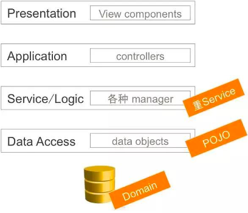
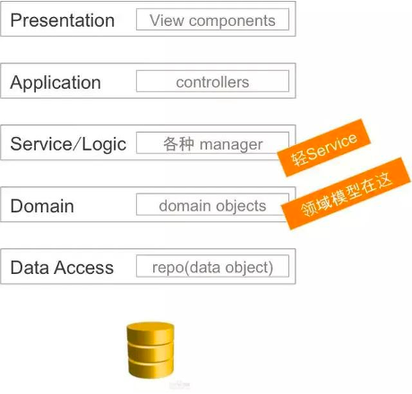
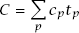

### 历史与发展
#### 源头
>《领域驱动设计:软件核心复杂性应对之道》[2010，Eric Evans]，开山鼻祖式的提出了领域驱动设计（DDD）这个概念。  

>《实现领域驱动设计》[2014，Vaughn Vernon]，第一本书更像是一个高屋建瓴的理论模型，本书更多是一种“软着陆”的思想，教导我们怎么把领域驱动设计落地到我们系统中。

#### 历史和发展
> 领域驱动是软件发展的自然结果，是对传统以数据为中心建模的反思。就像20世纪六七年代出现软件危机后，面向对象成为人们的救赎；瀑布开发遇到瓶颈时，敏捷开发登上舞台。

> 通常看法，DDD更适合大型软件系统，这也使很多软件开发者对DDD敬而远之。

*软件危机*
> 60年代中期，大容量、高速度计算机的出现，使计算机的应用范围迅速扩大，软件开发急剧增长。高级语言开始出现；操作系统的发展引起了计算机应用方式的变化；大量数据处理导致第一代数据库管理系统的诞生。软件系统的规模越来越大，复杂程度越来越高，软件可靠性问题也越来越突出。原来的个人设计、个人使用的方式不再能满足要求，迫切需要改变软件生产方式，提高软件生产率，软件危机开始爆发 。 

> 1968年，北大西洋公约组织（NATO）在联邦德国的国际学术会议创造软件危机（Software crisis）一词。而1960年代中期开始爆发众所周知的软件危机，为了解决问题，在1968、1969年连续召开两次著名的NATO会议，并同时提出软件工程的概念。

#### 现状
>近几年，随着微服务和中台化的思想的普及，领域驱动设计重归大家视野。从集中式架构到微服务，服务的粒度应该式多大？服务应该怎么样拆分？

>中台化同样也面临着服务拆封的问题，领域驱动设计这个精妙的领域建模的思想，恰好可以很好的解决微服务和中台化的服务拆分问题。

### 领域驱动设计的问题域
#### 工程现状
*贫血模型和失忆症*  
  
我们业务普遍以第一种模式拓展，没有领域模型，以数据库表为模型，在业务逻辑层、controller层加入大量的逻辑代码。这样模式，如果业务逻辑简单这样模式发展下去没有什么问题，随着业务复杂性上升，代码的可维护性越来越低，维护成本越来越高。面对这样的问题，过去我们通常的解决方案是“持续性重构”（敏捷开发中的一种模式）。
  
---   
*持续重构*  

持续性重构，虽然可以解决一些问题，我们常常用持续性重构的技巧往往逃脱不了类似于《重构》、《代码整洁之道》、《xxx开发规范》等等上面提到的方法技巧，这些技巧带来的往往是代码层面优化，但是缺乏业务含义。后续随着业务发展，其它小伙伴的代码编写，很容易就会闻到腐烂的味道。在业务复杂性到一定程度，仅仅凭借代码重构也会显得比较乏力。

---
*软件设计复杂性*  
复杂性（解释源自：A-Philosophy-of-Software）：    
>系统的总体复杂度（C）由每个部分的复杂度（cp）乘以开发人员在该部分上花费的时间（tp）加权。在一个永远不会被看到的地方隔离复杂性几乎和完全消除复杂性一样好。

>复杂性与软件系统的结构有关，这使它很难理解和修改系统。

>在复杂的系统中，要实施甚至很小的改进都需要大量的工作。

>复杂性是开发人员在尝试实现特定目标时在特定时间点所经历的。它不一定与系统的整体大小或功能有关。

复杂性体现方式：
* 变更放大：看似简单的变更需要在许多不同的地方进行代码修改
* 认知负荷：较高的认知负荷意味着开发人员必须花更多的时间来学习所需要的信息。
* 未知的未知：开发人员需要修改哪些代码活着获取哪些信息才能成功的执行任务，这些都是不明显的。

引起复杂性的原因：依赖性和模糊性
* 依赖性：软件设计的目标之一是减少依赖关系的数量，并使依赖关系保持尽可能简单和明显
* 模糊性：当重要信息不明显时，就会发生模糊。如：一个变量文档中没有指明单位，变量定义不明确等。

随着依赖性和模糊性的递增，复杂性会逐渐增大，显著影响软件系统的可维护性。  

*《领域驱动设计:软件核心复杂性应对之道》，本身思想是解决软件设计复杂性的，后续我们将讨论领域驱动如何解决复杂性问题。*

### 领域驱动设计

#### 战术工具 
抽象，分治，知识，聚合，实体对象，值对象，领域服务，领域事件，微领域，流程模版等，工具是可以拓展、变化、升级等跟我们业务场景做适配的。  

#### 战略建模  
界限上下文，核心域，通用子域，支撑子域    

#### 领域
领域与具体技术无关，是系统要解决所有问题的集合。  

核心域：  业务成功的主要因素，主要竞争力。核心域的开发最高的优先级和最优秀的开发团队。  

通用子域：业务系统的公共部分。

支撑子域：支撑核心域，而通用子域是业务系统的公用部分      

#### 界限上下文 
限界上下文包含的是一个系统、一个应用、一种业务服务以及一系列实现业务的复杂组件。  

#### 通用语言 
限界上下文中的每种领域术语、词组、或者句子都叫做通用语言，无论是领域专家和开发人员在对领域问题的沟通、需求的讨论，开发计划的制定、概念、还是代码中出现的类名与方法，都包括其中，而且要注意的一个规则是：只要是相同的意思，就应该使用相同的词汇。可以看出，这种通用语言不是一下子就可以形成，而是在一个各方人员的讨论中，不断发现、明确与提炼出来的。
  
#### 领域模型
领域模型其实就是把通用语言表达成软件模型，领域模型包括了模块、聚合、领域事件和领域服务等概念。
  
#### 实体  
实体的基本概念是一种贯穿整个生命周期的抽象连续性。一些对象主要不是它们属性定义的。它们实际上表示一条“标识线”，这条线经过一个时间跨度，而且对象在这条线上通常经历多种不同的表示。
它具有生命周期，这期间它们的形式和内容可能会发生根本变化，但其标识不变。
满足两个条件：一是在生命周期内具有连续性，二是它的一些对用户来说非常重要的不同状态不是由属性决定的。  
 
#### 值对象  

当我们只关心一个模型元素的属性时，应把它归类为值对象。我们应该使用这个模型元素能够标识出其属性的意义，并为它提供相关功能。一个值对象在创建之后便不能再变了。
我们应该尽量使用值对象来建模而不是实体对象。我们不用担心客户端对值对象的修改。一个值对象的生命周期可长可短，它就像是一个无害的过客在系统中来来往往。
  
#### 领域服务  
当领域中的某个操作过程或者转换过程不是实体或值对象的职责时，此时我们便应该将该操作放在一个单独的接口中。并且保证它是无状态的。    

#### 领域事件  
领域中所发生的活动建模成一系列的离散事件。每个事件都用领域对象来表示。领域事件是领域模型的组成部分，表示领域中所发生的事情。
  
#### 模块  
模块应该包含一组高内聚的概念集合，这样做的好处是可以在不同的模块之间实现松耦合。模块名是通用语言的一部分，模块名应该反映出它们在领域中的概念。    

#### 聚合  
聚合模式讨论的是对象组合和信息隐藏，同时还包含了一致性边界和事务。原则，设计小的聚合。在边界之外使用最终一致性。

### 实践技巧
隔离的&不是整体

领域驱动设计，是一个软件设计的方法论。
领域驱动设计不是一种设计风格，也不是一种架构模型，而是一种思考方式。
领域驱动设计有点：业务架构更加健壮
怎么算是一个领域，事件聚合，事件聚合后形成具体领域。领域知识会被沉淀，然后复用。

建模实际上是抽象，好的业务设计就是适度的抽抽抽，不要过度设计，过度设计往往是设计能力匹配不上你的代码，在能力范围内做抽象。

上下文，领域，子域，解决问题空间，存在问题空间

统一语言：
前提概念：
上下文，领域，子域，解决问题空间，存在问题空间
实体，值，业务规则
上下文：
* 足够规模承载一个事件模块
* 有明确的名称
* 有明确的界限职责
* 有统一对外交互的聚合根
* 
业务知识：

领域驱动是：一种思维模式，指导我们做到系统高内聚低耦合的一种方法论，最终形成一套知识体系（非经验主义）指导业务设计