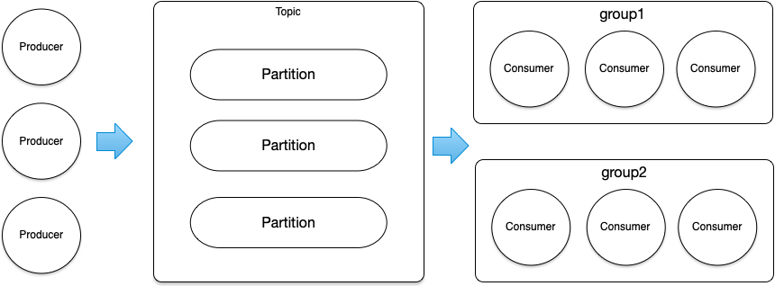
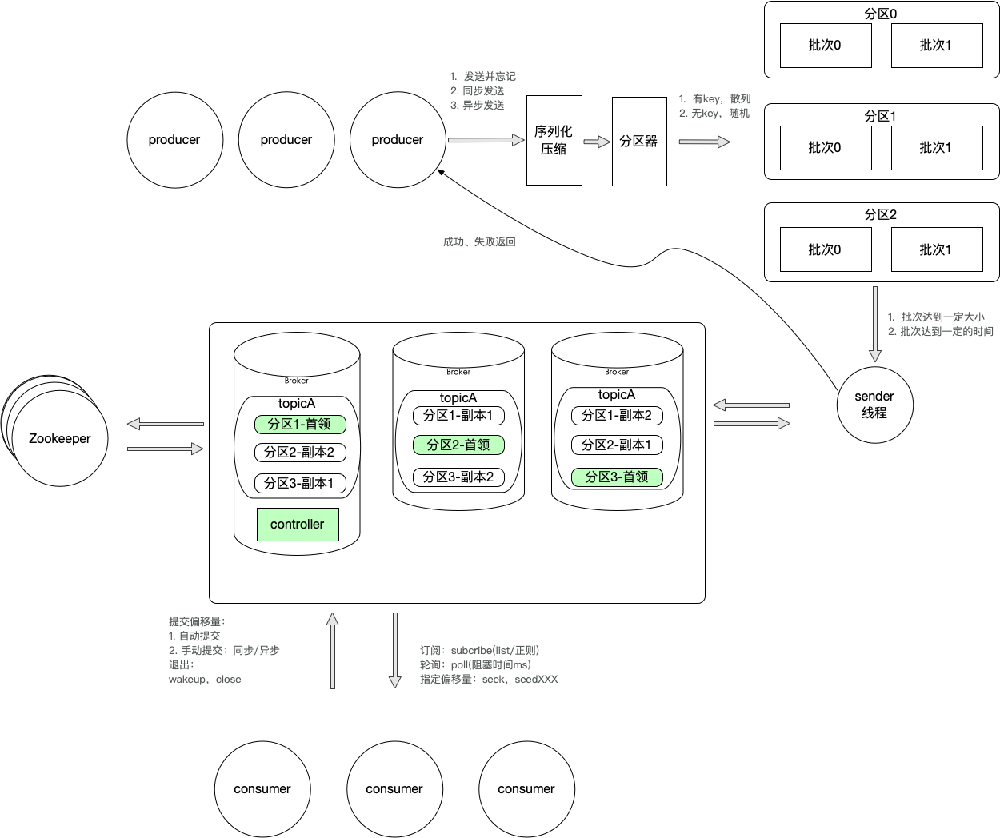

#### 基本概念
##### 基本领域概念

---
##### 基本流程图

控制器：分区首领的选举
再均衡：往群组添加消费者，消费者关闭，分区数量发生变化都会引起“再均衡”

#### 生产者
##### 方法

void produce(final String topic, final String messageKey, final byte[] message)
>异步发送消息,该方法会将消息放入本地缓冲区并立刻返回, 若此时宕机则该消息可能会永久丢失

void produce(final String topic,final String messageKey,final byte[] message,final Callback callback)
>异步发送消息,该方法支持callback以获取实际发送结果,该方法自身抛异常唯一的原因是参数非法，如某个参数为null

boolean syncProduce(final String topic, final String messageKey, final byte[] message)
>异步发送消息,但阻塞当前线程直到有结果返回（或抛异常）

##### 默认配置
配置|配置值
-|-
acks|1
retries|0
batch.size|16k
max.request.size|5M
linger.ms|20
compression.type|lz4
buffer.memory|32M
key.serializer|org.apache.kafka.common.serialization.StringSerializer
value.serializer|org.apache.kafka.common.serialization.ByteArraySerializer

#### 消费者
##### 方法
poll(100)，拉取消息，没有消息阻塞100ms
commitSync(offset)，同步提交，无论是StandardPoller还是ConcurrentPoller

##### 默认配置
配置|配置值
-|-
enable.auto.commit|false
session.timeout|15000
key.deserializer|org.apache.kafka.common.serialization.StringDeserializer
value.deserializer|org.apache.kafka.common.serialization.ByteArrayDeserializer
