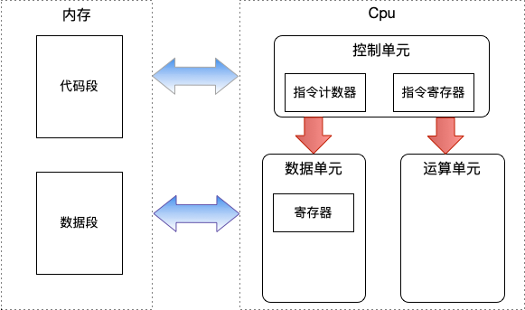
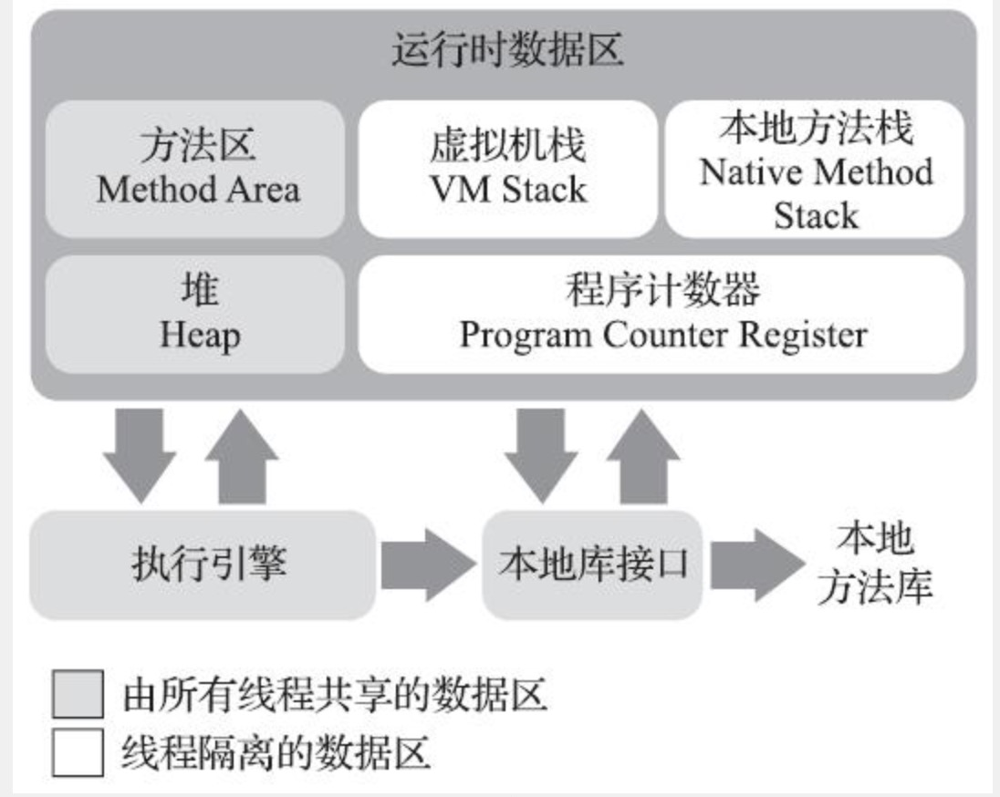
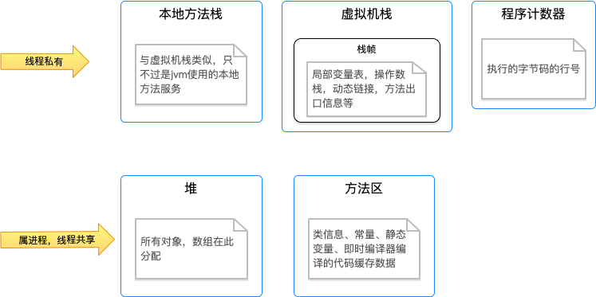
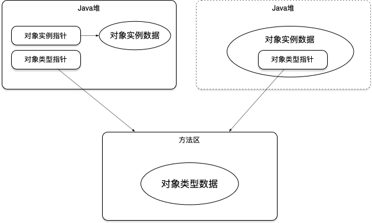

jvm是跨平台的，关于内存管理是自动化的。自动的内存管理，为我们隐藏的大量的细节，虽然方便了我们的开发，不过对于我们对于程序的理解是有所缺失的。对于代码的优化，线上性能调优等工作，对于这一块的知识是我们需要了解的。

### 一、内存基础理解

  

比较常见x86的cpu架构。从内存模型中，我们可以基本理解到，内存中主要存在的是数据和指令。

### 二、jmm（jvm 内存模型）
上述图主要为了更方便我们理解jvm内存管理，从基本的cpu架构中我们可以理解到内存中主要存的是指令和数据。
#### 指令
在jvm中，Java文件编译后生成的是.class文件，class文件中并不是常说的机器码，而是跨操作系统的统一封装的字节码。
#### 数据
对于数据，比较好理解，我代码执行过程中所形成，我们可以理解内存中存储的都是二进制。实际上是晶体管实现。

#### java内存区域
  
  
细化一下，内存模型中大概的数据情况
  

##### TLAB
在线程，共享的Java堆中可以划分出多个线程私有的分配缓冲区，以提升对象分配的效率（避免并发问题）。
##### 常量池
运行时常量池是方法区的一部分。用于存放在编译期生成的各种字面常量与符合引用。运行期间也可以将新的常量放入常量池。例如String类的intern()方法。

##### 对象的创建
当Java虚拟机遇到一个new指令时  

a. 首先检查这个指令的参数是否能在常量池中定位到一个类的符号引用，并且检查这个符号引用代表的类是否已被加载解析和初始化过，如果没有，那必须先执行类加载过程。  
b. 为新生对象分配内存。对象所需要的内存在类加载时就已经确定了。
分配的两种方式（指针碰撞，空闲列表）
内存分配时并发问题：CAS，TLAB  
c. 对象数据初始化，对象数据初始化为空  
d. 对象头设置（对象所属类，如何找到元数据信息，哈希码，gc分代年龄信息等）  
e. 调用<init>初始化对象数据

##### 对象的内存布局
Mark Word
* 存储对象自身运行数据，如哈希码，GC的分代年龄，锁状态标志，线程持有锁，偏向线程ID，偏向时间戳
* 32位，64位的虚拟机，分别有32，64位来存储。

##### 对象的访问定位
两种模式如下图所示，优缺点：  

第一种：比较灵活，对象的移动，对象类型指针不会变（对象在gc过程中经常移动）。

第二种：相比第一种，访问对象实例数据，少了一次内存访问。

  

### 三、内存溢出
##### 堆溢出
出现堆内存溢出时有两种可能，内存泄露&内存溢出，通常解决方案--XX：+HeapDumpOnOutOfMemoryError，或者其它的dump工具。
堆内存泄漏：泄漏对象到GC Roots的引用连，找到泄漏对象是怎么引用路径，与哪些GC Root相关联，才导致垃圾收集器无法回收它们。
堆内存溢出：调整堆大小 & 代码优化

##### 虚拟机栈溢出和本地方法栈溢出
a. 线程请求的栈深度大于虚拟机所允许的最大深度，将抛出StackOverflowError异常。  
b. 如果虚拟机的栈内存允许动态扩展，当扩展容量无法申请到足够的内存时，将抛出OutOfMemoryError异常。HotSpot是不支持动态扩展的。不同的操作系统会有最小的栈内存限制。但是在创建内存时，如果无法申请到足够内存会出现OutOfMemoryError。  
c. 在Hotspot虚拟机中并不区分虚拟机栈和本地方法栈，栈容量只能由-Xss参数来设定。  
d. 为每个线程分配的栈内存越大，可以建立的线程数量自然就少，建立线程时就越容易把剩下的内存耗尽。  
e. 如果建立过多线程导致内存溢出，在不能减少线程数量或者更换64虚拟机的情况下，只能通过减少最大堆（增大栈内存）和减少栈容量（代码优化）来换取更多的线程。

##### 方法区和运行时常量池溢出
* a. jdk6之前版本，方法区、常量池是存储在永久代（参数：-XX:PermSize -XX:MaxPermSize），通过jdk7开始去永久代计划，并在jdk8中通过元空间(--XX:MaxMetaspaceSize)来代替永久代.  
* b. jdk7开始，原本存放在永久代的字符串常量池被移至Java堆中。    
* c. 方法区的其它部分类名、访问修饰符、字段描述、方法描述等。当大量的动态代理类时，可能会造成溢出。 
* d. jdk8中的元空间，已经很难迫使虚拟机产生方法区溢出的异常。Hotspot还是提供了一些参数作为元空间的预防措施。    
  * -XX:MaxMetaspaceSize: 元空间最大大小。默认-1，不限制。 
  * -XX:MetaspaceSize：元空间初始化大小，达到改值，触发垃圾收集器进行类型卸载。
  * -XX:MinMetaspaceFreeRatio：垃圾收集后控制最小元空间剩余容量百分比。控制垃圾收集频率。

##### 本机直接内存溢出
-XX:MaxDirectMemorySize来指定