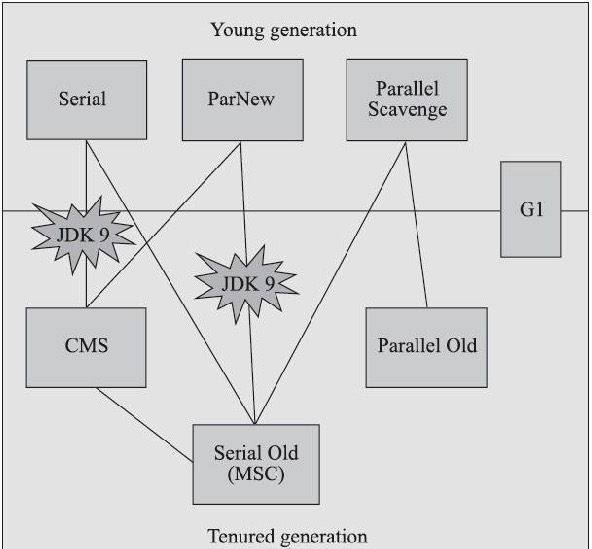

“经典”二字并非情怀，是讨论范围的限定语。讨论的是JDK7Update4之后，JDK11正式发布之前，OracleJDK中的HotSpot虚拟包含的全部垃圾收集器。
  

如图中所示，经典的垃圾收集器指的上图中七种垃圾收集器，线以上的是年轻代垃圾收集器，线以下的是老年代垃圾收集器，其中有连线的代表可以配合使用的。在学习这些垃圾收集器之前，需要先明确一个观点：垃圾收集器在不断的进步，但直到现在还没有最好的收集器出现，更加不存在“万能”的收集器，所以我们应用选择收集器时只选择更合适的。

* 从Jdk1.3开始，一直到现在的jdk13，Hotspot团队为了消除或者降低用户线程因为垃圾收集导致的停顿一直持续努力。从Serial收集器到Parallel收集器，再到CMS，G1，最终至现在最前沿的成果Shenandoah和ZGC，设计越来越精妙，用户线程的停顿时间在持续缩短，但是仍然没有办法彻底消除。
* 在垃圾收集中，并行（Parallel）指的多条垃圾收集器线程之间的关系，通常默认的是用户线程处于等待状态。并发（Concurrent）指的垃圾收集器线程与用户线程之间的关系，用户线程未被冻结，不过吞吐量受到一定影响。
* 吞吐量=运行用户代码时间/（运营用户代码时间+运行垃圾收集时间）
* 并发处理器出现之前，GC过程可以总结为，新生代：用户线程->安全点->Stop the world 标记复制（单线程/并行），老年代：用户线程->安全点->Stop the world 标记整理（单线程/并行）
* 衡量垃圾收集器的三项最重要的指标是：内存占用、吞吐量和延迟，三者共同构成了一个“不可能的三角”
  
### Serial收集器
看名字就可以理解到，Serial是一个单线程工作的收集器，它只会使用一个线程去完成垃圾收集工作，并且在进行垃圾收集时会“Stop The World” 中止用户线程。Serial作为年轻代收集器，采用标记复制算法，暂停所用用户线程。  

最初大家觉得Stop the world是一个合情合理的事情，随着应用的发展，现在Serial收集器越来越鸡肋。不过在一些单核或者少核处理器，虚拟机分配的内存较小的环境中，垃圾收集不是很频繁，一次停顿可能只需要几十上百毫秒，Serial也是很好的选择。

### Serial Old收集器
Serial Old为老年代收集器，单线程，采用标记整理算法，暂停所有用户线程。
### ParNew收集器
ParNew实质上是Serial收集器的多线程并行版本，同样也会暂停所有的用户线程，只是支持并发收集。  

JDK7之前的系统ParNew还是首选的新生代收集器，因为除了Serial收集器外，目前只有它能与CMS配合工作。  

G1登场后，ParNew+CMS不再是官方首推的方案，希望它可以被G1取代，甚至还取消了ParNew+Serial Old，Serial + CMS的组合（意味着ParNew+CMS只能配合）。并直接取消了-XX：+UseParNewGC参数（取消意味默认采用），可以理解ParNew并入了CMS，称为CMS专门处理新生代的组成部分。ParNew可以说是HotSpot虚拟机中第一款推出历史舞台的垃圾收集器。

### Parallel Scavenge
Parallel和ParNew类似，同样是标记复制，并行收集，那么他们有什么不同之处呢？
Parallel Scavenge收集器的关注点与其它收集器不同，目标是达到可控的吞吐量，提供了两个参数用于精确的控制吞吐量。
* -XX:MaxGCPauseMillis：最大垃圾收集停顿时间设置，运行的值是一个大于0的毫秒数。收集器将会尽量保证内存回收不超过用户设定的值。不过并不是参数值设置的越小，系统垃圾收集速度越快。垃圾收集停顿时间是牺牲吞吐量和新生代内存大小换取的。例如：新生代500M调整到300M,垃圾收集时间肯定要变短，不过垃圾收集发生的更频繁了，原来10秒发生一次，每次停顿100ms，现在5ms发生一次，每次停顿70ms，吞吐量也下降了。
  
* -XX:GCTimeRatio：用于控制吞吐量，参数值1-99的整数，垃圾收集时间占比=1/(1+x)。垃圾收集时间占总时间的比率，相当于吞吐量的倒数。例如设置99，那么垃圾收集时间占比为，1/(1+99)=1%，此时吞吐量为99。

由于与吞吐量关系密切，Parallel Scavenge收集器也经常被称作“吞吐量优先收集器”。除了上述两个参数还有一个重要参数，-XX:+UseAdaptiveSizePolicy，这个参数被激活后，就不需要手工制定新生代大小，Eden与Survivor比例、晋升老年代对象大小等细节参数了。这种调节方式称为垃圾收集器自适应调节策略（GC Ergonomics）。

### Parallel Old收集器
Parallel Old是Parallel Scavenge的老年代版本，基于标记整理，支持多线程并行收集。其实比较简单，Parallel Scavenge收集器出现后，不能与CMS配合使用，只能与Serial Old配合使用，在多核处理器环境下效率底下，因此出现了Parallel Old。

### CMS（Concurrent Mark Sweep）收集器
从名字就可以知道，CMS是并发、标记清理的垃圾收集器。是一种以获取最短回收停顿时间为目标的收集器。
#### CMS过程
相对于之前的几种收集器，整个过程更复杂一些，整个过程分为四个步骤：
* 初始标记（CMS initial mark）：标记一下从GC Roots可以直接关联的对象，耗时较短，Stop The World。
* 并发标记（CMS concurrent mark）：从GC Roots直接关联的对象，开始遍历整个对象图的过程，耗时较长，与用户线程并发执行。
* 重新标记（CMS remark）：为了修正并发标记期间，因用户线程继续运作而导致标记产生变动的那一部分对象的标记记录。（采用增量更新）
* 并发清除（CMS concurrent sweep）。采用标记清除算法并发清除。由于CMS采用并发清除，不需要移动存活对象，完全可以与用户线程并发执行。

#### CMS缺点
CMS是一个并发收集、低停顿，是HotSpots虚拟机追求低停顿的第一次成功尝试。不过它还远没有达到完美的程度，至少有以下三个明显的缺点：
  1. CMS收集器对处理器资源非常敏感。在并发阶段虽然不会导致用户线程停顿，但是却会因为占用一部分线程，而导致应用程序变慢，降低吞吐量。CMS默认线程数是（处理器核心数量+3）/4，如果处理器核心数量比较少，应用本来负载比较高，会降低应用的吞吐量。
  2. CMS处理器无法处理“浮动垃圾”（Floating Garbage）。在并发标记/并发清除阶段，用户线程产生的垃圾对象不能被回收，只好留待到下次回收时，进行回收。因此CMS老年代，需要预留一部分空间给并发收集时用户线程使用。-XX:CMSInitiatingOccu-pancyFraction参数可以调整，JDK5默认是68%，JDK6默认是92%。当内存无法满足时，会触发一次“并发失败”（Concurrent Mode Failure）,然后临时启用Serial Old，中断用户线程，进行一次FullGC。
  3. CMS会产生大量的空间碎片。CMS采用标记清除算法，意味着会产生大量的空间碎片。当空间碎片过多，分配一个大对象时，由于无法找到足够大的连续空间分配大对象，不得不提前触发Serial Old进行FullGC。

### Garbage First收集器
JDK9发布之日，G1宣告取代Parallel Scavenge+Parallel Old组合，成为服务端模式下的默认垃圾收集器。作为CMS收集器的替代者和继承人，设计者希望做出一款能够支持指定在一个长度为M毫秒的时间片段内，消耗在垃圾收集上的时间大概率不超过N毫秒这样的目标。那么怎么实现这个目标呢？

#### Region布局
G1跳出了之前整代（young/Major/Full）收集的思想，收集衡量标准不在是哪个分代，而是哪块内存中垃圾最多，回收收益最大。G1开创的Region的堆内存布局是它能够实现这个目标的关键。
* G1不再坚持固定大小以及固定数量的分代区域划分，而是把连续的Java堆划分为多个大小相等的区域（Region）
* 每个Region根据需要，扮演新生代的Eden空间、Survivor空间或者老年代。
* Region还有一个特殊的Humongous区域，专门用来储存大对象。G1认为只要大小超过了一个Region容量一半的对象，即可判定为大对象。那些超过了整个Region大小的大对象，会被存放在N个连续的Humongous Region中。
* 每个Region的大小可以通过参数-XX:G1HeapRegionSize设定。

每次回收，收集到的内存空间都是Region大小的整数倍，这样可以有计划地避免在整个Java堆中进行全区域垃圾收集。就可以有效控制停顿时间

#### 停顿预测模型
用户通过-XX:MaxGCPauseMillis参数可以指定期望停顿时间，那么G1收集要怎么满足用户的期望呢？
* G1收集器的停顿预测模型是以衰减均值（Decaying Average）为理论基础来实现的。
* 在垃圾收集过程中，G1收集器会记录每个Region的回收耗时、每个Region记忆集里脏卡数量等可测量的步骤花费的成本，并分析得出平均值、标准偏差、置信度等统计信息。
* “衰减均值” 是一种简单的数学方法，用来计算一个数列的平均值，核心是近期数据更高的权重，即强调近期数据对结果的影响。
* 然后G1通过预测得到，哪些Region组成的回收集可以在不超过期望停顿时间的约束下获得最高收益。

#### G1过程
G1收集器跟CMS类似，也是4个过程：
1. 初始标记（Initial Marking）
   仅仅标记一下GC Roots能直接关联的对象，并且修改TAMS指针，让下一阶段可以正确的在Region中分配对象。这阶段Stop The World，不过耗时很短。 
2. 并发标记（Concurrent Marking）
   GC Root对堆中对象进行可达性分析，递归扫描整个堆里的对象图。与用户线程并发执行，耗时较长。
3. 最终标记（Final Marking）
   采用SATB处理，并发过程的引用删除。Stop The World。
4. 筛选回收（Live Data Counting and Evacuation）
   更新Region的统计数据，对各个Region的回收价值和成本进行排序，根据期望停顿时间，选择回收的Region集。决定回收的部分，复制到空的Region，再清理整个Region空间。回收操作涉及到活对象移动，必须Stop The World。

#### G1与CMS对比
* G1整体上看是基于“标记-整理”算法实现的收集器，两个Region之间是基于“标记-复制”，无论如何都不会产生内存空间碎片。
* 内存占用方面，虽然G1和CMS都是基于卡表，但是G1实现更为复杂，可能会占用整个堆容量的20%。CMS卡表只需唯一一份，而且只需要处理老年代到新生代引用。
* 执行负载角度，两个都机器都会造成负载。例如写屏障，CMS采用写后屏障，G1采用写前屏障。SATB相对于增量更新，会消耗更多资源。

总体上来讲，在小内存应用上CMS的表现大概率会优与G1，而在大内存应用G1则要优于CMS。不过这也是经验只谈，不同应用需要量体裁衣的实际测试才能得出最合适的结论。
