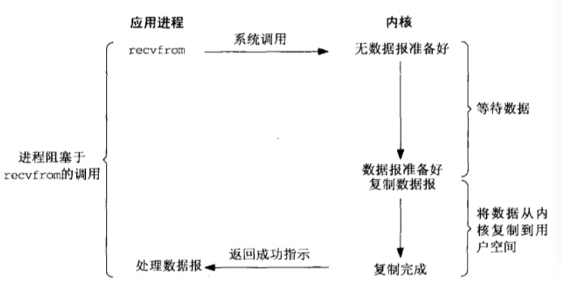
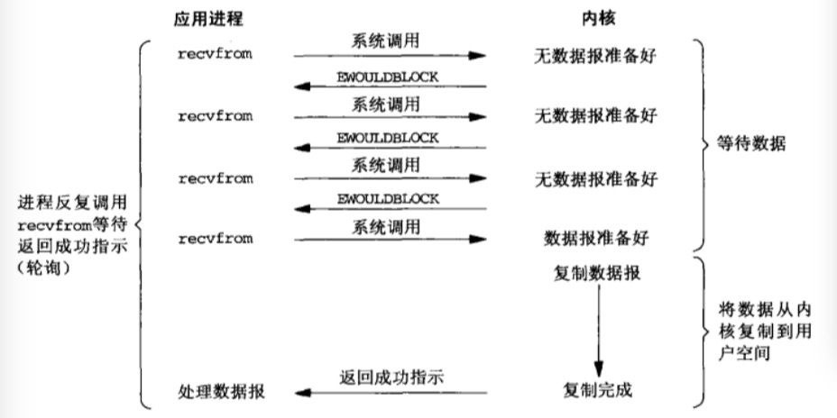
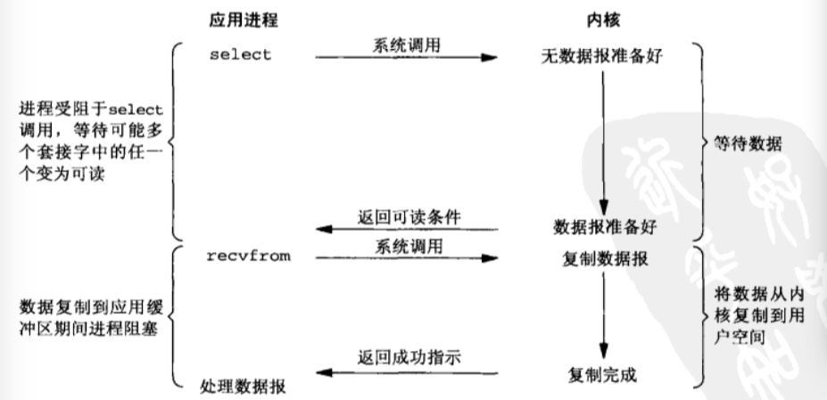
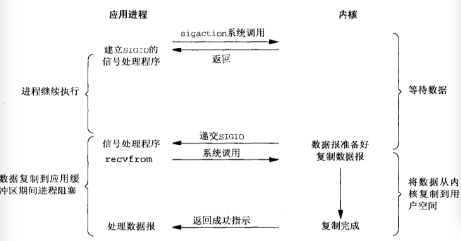
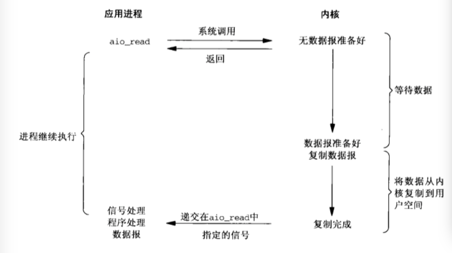

### 简谈I/O模型  
 
提到IO模型，通常会想到，异步，同步，阻塞，非阻塞，对于这这几种模型，在网上找资料时，大多是通过一个生动的场景来描述，但是这样也不会严谨的给出一个定义或结论。不过还好的是，看到一些资料上引用了《UNIX网络编程卷一》的一些定义来给出结论。查看了《UNIX网络编程》的一些章节，对于io模型，书中给出以下的几种IO模型：    

* 阻塞 
* 非阻塞  
* 事件驱动  
* 复用  
* 异步  
  
例子中一个输入操作包括两个不同的阶段：    

1. 等待数据准备好  
2. 从内核向进程复制数据  
对于一个套接字上的输入操作，第一步通常涉及等待数据从网络到达。当所等待分组到达时，它被复制到内核中的某个缓冲区。第二步就是把数据从内核的缓冲区复制到应用进程的缓冲区。  

##### 阻塞式I/O模型  
最流行的I/O模型，如下图  


示例中recvfrom函数视为系统调用，进程调用recvfrom，其系统调用直到数据到达且被复制到应用进程的缓冲区中或者发生错误才返回。进程在从调用recvfrom开始到它返回的整段时间内是被阻塞的。recvfrom成功返回后，应用进程开始处理数据。  

##### 非阻塞式I/O模型    
模型如下图：

从图中可以看出，前三次调用数据没有准备好，内核立即返回一个EWOULDBLOCK的错误。第四次调用recvfrom时已有一个数据报准备好，它被复制到应用进程的缓冲区，于是recvfrom成功返回。  
当一个应用进程像这样对一个非阻塞描述符循环调用recvfrom时，成为轮询(polling)。应用进程持续轮询内核，以查看某个操作是否就绪。这么做往往会耗费大量CPU时间。  

##### I/O复用模型    
有了I/O复用，就可以调用select或poll，阻塞在这两个系统调用的某一个之上，而不是阻塞在真正的I/O系统调用上。 


从图中可以看出进程阻塞于select调用，等待数据报套接字变为可读。当select返回套接字可读这一条件时，调用recvfrom把所读数据报复制到应用进程缓冲区。  
与该模型有点相似的场景，可以通过多线程操作多个阻塞式I/O，性能的话可以相对去比较，多线程涉及到上线文切换，高并发是不合适的。  
	
##### 信号驱动式I/O模型  


该IO模型，从图中可以看出，当内核数据准备好时，会通过sigaction系统发送一个SIGIO信号，告诉应用程序，然后应用程序再调用recvfrom从内核缓存中拷贝数据。这样应用程序不需要阻塞的，还可以继续执行其它逻辑。  

##### 异步I/O模型  

从图中可以看出，应用进程调用aio_read后，告诉内核传递描述符，缓冲区指针、大小，完成后如何通知进程等。并立即返回。在执行IO执行完毕以后告诉进程数据以及准备完成。此处的信号与信号驱动不同点在于，该信号只会通知内核I/O什么时候完成，而信号驱动会通知进程何时启动一个I/O操作。   

##### 模型之间的比较与总结    

* 阻塞式I/O，一次调用知道数据处理完成，一直同步。  
* 非阻塞I/O，需要轮询去检查内核是否数据处理完成，不会导致进程堵塞    
* 真正实现异步的只有异步I/O
  
  

